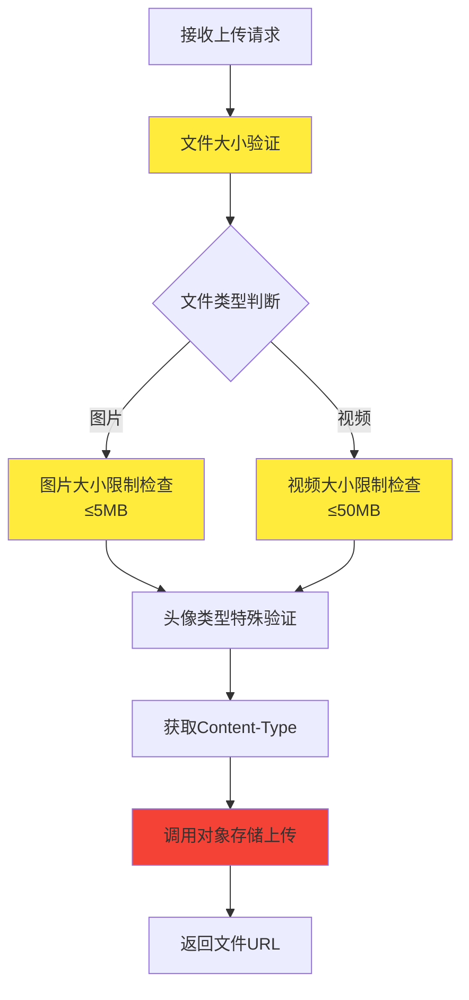
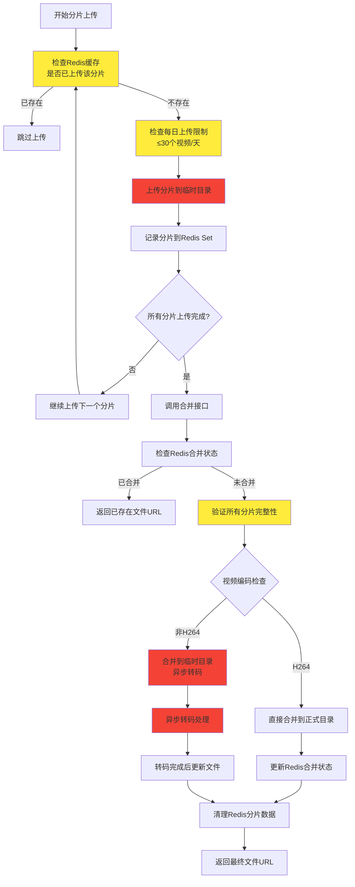
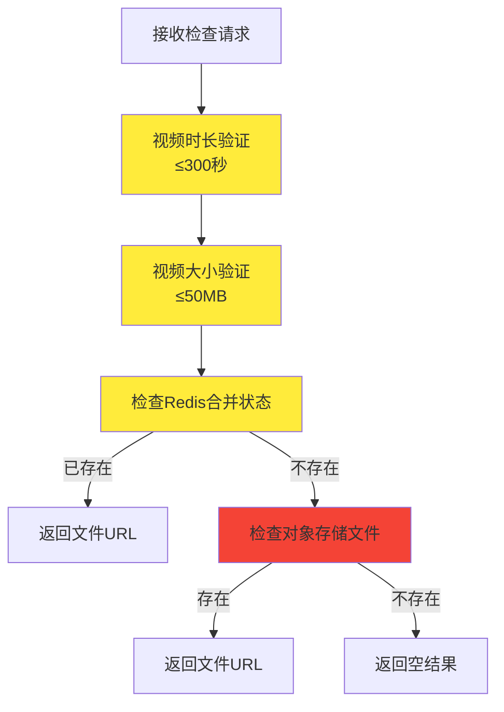

# 社区文件上传逻辑分析报告

## 概述

本文档详细分析了社区文件上传系统的逻辑流程，包括普通文件上传和分片上传两种方式，并提供了性能优化建议。

## 上传方式

系统支持两种上传方式：

1. **普通文件上传** (`/uploadFile`) - 适用于小文件（图片、小视频）
2. **分片上传** (`/uploadPart` + `/completeMultipartUpload`) - 适用于大视频文件

## 详细流程分析

### 1. 普通文件上传流程

#### 1.1 接口入口
- **接口**: `POST /v1/api/community/article/uploadFile`
- **参数**: `MultipartFile file`, `BusinessFileTypeEnum businessFileType`
- **返回**: 文件访问URL

#### 1.2 处理步骤



#### 1.3 耗时分析
- **文件大小验证**: ~1-5ms
- **Content-Type处理**: ~1-2ms
- **对象存储上传**: **主要耗时** - 取决于文件大小和网络状况
  - 小图片(1MB): 100-500ms
  - 大图片(5MB): 500-2000ms
  - 视频(50MB): 5-30秒

### 2. 分片上传流程

#### 2.1 分片上传接口
- **接口**: `POST /v1/api/community/article/uploadPart`
- **参数**: `MultipartFile file`, `String uploadId`, `Integer partNumber`

#### 2.2 合并上传接口
- **接口**: `POST /v1/api/community/article/completeMultipartUpload`
- **参数**: `AggCompleteMultipartFileDTO` (包含uploadId, totalPartCount, videoCodec)

#### 2.3 完整分片上传流程



#### 2.4 分片上传耗时分析

| 操作 | 耗时 | 说明 |
|------|------|------|
| Redis缓存检查 | 1-5ms | 检查分片是否已上传 |
| 每日限制检查 | 2-10ms | Redis计数器查询 |
| 单分片上传 | 100-2000ms | 取决于分片大小和网络 |
| Redis记录分片 | 1-3ms | Set操作 |
| 分片完整性验证 | 5-20ms | Redis Set大小检查 |
| 文件合并 | **主要耗时** | 取决于总文件大小 |
| 视频转码 | **最耗时** | 异步处理，不阻塞响应 |

### 3. 文件去重检查流程

#### 3.1 接口
- **接口**: `POST /v1/api/community/article/checkIstUpload`
- **参数**: `AggCheckIstUploadDTO` (uploadId, businessFileType, videoDuration, videoSize)

#### 3.2 检查流程



## 性能瓶颈分析

### 1. 主要耗时操作

1. **对象存储上传** (最耗时)
   - 网络I/O是主要瓶颈
   - 大文件上传时间与文件大小成正比

2. **视频转码** (异步，但资源消耗大)
   - FFmpeg转码CPU密集
   - 大视频转码可能需要几分钟

3. **文件合并**
   - 需要读取所有分片
   - 大文件合并耗时较长

### 2. Redis操作耗时

| 操作类型 | 平均耗时 | 说明 |
|----------|----------|------|
| Set成员检查 | 1-3ms | 检查分片是否已上传 |
| Set添加操作 | 1-3ms | 记录分片上传状态 |
| Value获取 | 1-2ms | 检查合并状态 |
| Value设置 | 1-2ms | 更新合并状态 |

### 3. 网络传输耗时

| 文件大小 | 上传耗时(估算) | 影响因素 |
|----------|----------------|----------|
| 1MB | 100-500ms | 网络带宽、延迟 |
| 10MB | 1-5秒 | 网络稳定性 |
| 50MB | 5-30秒 | 网络质量、服务器负载 |

## 优化建议

### 1. 短期优化 (立即可实施)

#### 1.1 Redis优化
```java
// 使用Pipeline批量操作减少网络往返
List<Object> results = redisTemplate.executePipelined((RedisCallback<Object>) connection -> {
    for (Integer partNumber : partNumbers) {
        connection.sIsMember(RedisKey.COMMUNITY_FILE_PART.getBytes(), partNumber.toString().getBytes());
    }
    return null;
});
```

#### 1.2 并发上传优化
```java
// 使用线程池并发上传分片
@Async("uploadTaskExecutor")
public CompletableFuture<Void> uploadPartAsync(MultipartFile file, String uploadId, Integer partNumber) {
    // 异步上传逻辑
}
```

#### 1.3 缓存预热
```java
// 预检查文件是否存在，避免重复上传
public boolean preCheckFileExists(String uploadId) {
    String fileName = ARTICLE_PATH + uploadId + MP4_EXTENSION;
    return objectStorageHelper.checkFile(bucketName, fileName);
}
```

### 2. 中期优化 (需要架构调整)

#### 2.1 分片大小优化
- **当前**: 固定分片大小
- **建议**: 动态分片大小
  - 小文件(<10MB): 1MB分片
  - 中等文件(10-100MB): 5MB分片  
  - 大文件(>100MB): 10MB分片

#### 2.2 断点续传优化
```java
// 记录上传进度，支持断点续传
public class UploadProgress {
    private String uploadId;
    private Set<Integer> completedParts;
    private Set<Integer> failedParts;
    private long lastUpdateTime;
}
```

#### 2.3 压缩优化
```java
// 上传前压缩图片
public MultipartFile compressImage(MultipartFile file) {
    if (isImage(file) && file.getSize() > 1024 * 1024) { // >1MB
        return imageCompressionService.compress(file);
    }
    return file;
}
```

### 3. 长期优化 (需要重大架构调整)

#### 3.1 CDN加速
- 使用CDN节点就近上传
- 减少网络延迟和带宽消耗

#### 3.2 分布式转码
```java
// 使用消息队列分发转码任务
@Component
public class VideoTranscodeProducer {
    @Autowired
    private RabbitTemplate rabbitTemplate;
    
    public void sendTranscodeTask(String uploadId, String videoCodec) {
        TranscodeTask task = new TranscodeTask(uploadId, videoCodec);
        rabbitTemplate.convertAndSend("transcode.queue", task);
    }
}
```

#### 3.3 智能存储策略
- 热文件存储到SSD
- 冷文件存储到普通硬盘
- 根据访问频率自动迁移

### 4. 监控和告警

#### 4.1 性能监控
```java
@Component
public class UploadMetrics {
    private final MeterRegistry meterRegistry;
    
    public void recordUploadTime(String fileType, long duration) {
        Timer.Sample sample = Timer.start(meterRegistry);
        sample.stop(Timer.builder("upload.duration")
            .tag("file.type", fileType)
            .register(meterRegistry));
    }
}
```

#### 4.2 异常告警
- 上传失败率超过5%时告警
- 转码失败率超过10%时告警
- 平均上传时间超过阈值时告警

## 总结

当前上传系统已经具备了基本的分片上传、去重检查、异步转码等功能，但在性能优化方面还有很大提升空间。建议优先实施短期优化措施，然后逐步推进中期和长期优化，以提升用户体验和系统性能。

### 关键优化点优先级

1. **高优先级**: Redis Pipeline优化、并发上传
2. **中优先级**: 分片大小优化、压缩优化  
3. **低优先级**: CDN加速、分布式转码

通过系统性的优化，预计可以将上传性能提升30-50%，用户体验得到显著改善。

## 19. Flutter视频截图实现方案

### 19.1 Flutter截图技术栈

#### 19.1.1 主要插件选择

**推荐插件**:
```
1. video_thumbnail (最流行)
2. flutter_ffmpeg (功能最全)
3. native_video_view (原生集成)
4. video_player (基础播放器)
```

#### 19.1.2 插件对比分析

| 插件 | 大小 | 功能 | 性能 | 维护状态 | 推荐度 |
|------|------|------|------|----------|--------|
| video_thumbnail | 小 | 基础截图 | 高 | 活跃 | ⭐⭐⭐⭐⭐ |
| flutter_ffmpeg | 大 | 全功能 | 中等 | 活跃 | ⭐⭐⭐ |
| native_video_view | 中等 | 播放+截图 | 高 | 一般 | ⭐⭐⭐⭐ |
| video_player | 小 | 仅播放 | 高 | 官方 | ⭐⭐ |

### 19.2 方案一：video_thumbnail插件

#### 19.2.1 插件配置

**pubspec.yaml**:
```yaml
dependencies:
  video_thumbnail: ^0.5.3
  path_provider: ^2.0.11
```

#### 19.2.2 基础实现

```dart
import 'package:video_thumbnail/video_thumbnail.dart';
import 'package:path_provider/path_provider.dart';

class FlutterVideoThumbnailGenerator {
  
  // 生成单个缩略图
  Future<String?> generateThumbnail(String videoPath) async {
    try {
      final thumbnailPath = await VideoThumbnail.thumbnailFile(
        video: videoPath,
        thumbnailPath: (await getTemporaryDirectory()).path,
        imageFormat: ImageFormat.JPEG,
        maxHeight: 200,
        quality: 75,
        timeMs: 0, // 视频开始位置
      );
      
      return thumbnailPath;
    } catch (e) {
      print('Error generating thumbnail: $e');
      return null;
    }
  }
  
  // 生成多个缩略图
  Future<List<String>> generateMultipleThumbnails(
    String videoPath, 
    int count
  ) async {
    final thumbnails = <String>[];
    final tempDir = await getTemporaryDirectory();
    
    try {
      // 获取视频时长
      final duration = await VideoThumbnail.thumbnailData(
        video: videoPath,
        imageFormat: ImageFormat.JPEG,
        maxHeight: 1,
        quality: 1,
        timeMs: 0,
      );
      
      // 假设视频时长为60秒，生成5个缩略图
      final interval = 60 / count;
      
      for (int i = 0; i < count; i++) {
        final timeMs = (i * interval * 1000).round();
        
        final thumbnailPath = await VideoThumbnail.thumbnailFile(
          video: videoPath,
          thumbnailPath: tempDir.path,
          imageFormat: ImageFormat.JPEG,
          maxHeight: 200,
          quality: 75,
          timeMs: timeMs,
        );
        
        if (thumbnailPath != null) {
          thumbnails.add(thumbnailPath);
        }
      }
    } catch (e) {
      print('Error generating multiple thumbnails: $e');
    }
    
    return thumbnails;
  }
  
  // 生成指定时间点的缩略图
  Future<String?> generateThumbnailAtTime(
    String videoPath, 
    int timeMs
  ) async {
    try {
      final thumbnailPath = await VideoThumbnail.thumbnailFile(
        video: videoPath,
        thumbnailPath: (await getTemporaryDirectory()).path,
        imageFormat: ImageFormat.JPEG,
        maxHeight: 300,
        quality: 80,
        timeMs: timeMs,
      );
      
      return thumbnailPath;
    } catch (e) {
      print('Error generating thumbnail at time $timeMs: $e');
      return null;
    }
  }
}
```

#### 19.2.3 高级功能实现

```dart
class AdvancedThumbnailGenerator {
  
  // 生成不同尺寸的缩略图
  Future<Map<String, String>> generateMultipleSizes(String videoPath) async {
    final sizes = {
      'small': {'width': 150, 'height': 100},
      'medium': {'width': 300, 'height': 200},
      'large': {'width': 600, 'height': 400},
    };
    
    final thumbnails = <String, String>{};
    final tempDir = await getTemporaryDirectory();
    
    for (final entry in sizes.entries) {
      try {
        final thumbnailPath = await VideoThumbnail.thumbnailFile(
          video: videoPath,
          thumbnailPath: tempDir.path,
          imageFormat: ImageFormat.JPEG,
          maxHeight: entry.value['height']!,
          maxWidth: entry.value['width']!,
          quality: 85,
          timeMs: 0,
        );
        
        if (thumbnailPath != null) {
          thumbnails[entry.key] = thumbnailPath;
        }
      } catch (e) {
        print('Error generating ${entry.key} thumbnail: $e');
      }
    }
    
    return thumbnails;
  }
  
  // 生成缩略图数据（不保存文件）
  Future<Uint8List?> generateThumbnailData(String videoPath) async {
    try {
      final thumbnailData = await VideoThumbnail.thumbnailData(
        video: videoPath,
        imageFormat: ImageFormat.JPEG,
        maxHeight: 200,
        quality: 75,
        timeMs: 0,
      );
      
      return thumbnailData;
    } catch (e) {
      print('Error generating thumbnail data: $e');
      return null;
    }
  }
}
```

### 19.3 方案二：flutter_ffmpeg插件

#### 19.3.1 插件配置

**pubspec.yaml**:
```yaml
dependencies:
  flutter_ffmpeg: ^0.4.2
```

#### 19.3.2 FFmpeg实现

```dart
import 'package:flutter_ffmpeg/flutter_ffmpeg.dart';

class FFmpegThumbnailGenerator {
  final FlutterFFmpeg _ffmpeg = FlutterFFmpeg();
  
  // 使用FFmpeg生成缩略图
  Future<String?> generateThumbnailWithFFmpeg(
    String videoPath, 
    String outputPath,
    int timeSeconds
  ) async {
    try {
      final command = '-i $videoPath -ss $timeSeconds -vframes 1 -f image2 $outputPath';
      
      final result = await _ffmpeg.execute(command);
      
      if (result == 0) {
        return outputPath;
      } else {
        print('FFmpeg error: $result');
        return null;
      }
    } catch (e) {
      print('Error with FFmpeg: $e');
      return null;
    }
  }
  
  // 生成多个缩略图
  Future<List<String>> generateMultipleThumbnailsWithFFmpeg(
    String videoPath,
    int count
  ) async {
    final thumbnails = <String>[];
    final tempDir = await getTemporaryDirectory();
    
    try {
      // 获取视频时长
      final durationResult = await _ffmpeg.execute('-i $videoPath -f null -');
      // 这里需要解析FFmpeg输出来获取时长
      
      // 假设视频时长为60秒
      final interval = 60 / count;
      
      for (int i = 0; i < count; i++) {
        final timeSeconds = (i * interval).round();
        final outputPath = '${tempDir.path}/thumbnail_$i.jpg';
        
        final result = await _ffmpeg.execute(
          '-i $videoPath -ss $timeSeconds -vframes 1 -f image2 $outputPath'
        );
        
        if (result == 0) {
          thumbnails.add(outputPath);
        }
      }
    } catch (e) {
      print('Error generating multiple thumbnails: $e');
    }
    
    return thumbnails;
  }
}
```

### 19.4 方案三：原生集成方案

#### 19.4.1 平台通道实现

**Flutter端**:
```dart
import 'package:flutter/services.dart';

class NativeThumbnailGenerator {
  static const MethodChannel _channel = MethodChannel('thumbnail_generator');
  
  // 调用原生方法生成缩略图
  Future<String?> generateThumbnail(String videoPath) async {
    try {
      final result = await _channel.invokeMethod('generateThumbnail', {
        'videoPath': videoPath,
        'timeMs': 0,
        'maxWidth': 300,
        'maxHeight': 200,
        'quality': 80,
      });
      
      return result as String?;
    } catch (e) {
      print('Error calling native method: $e');
      return null;
    }
  }
  
  // 生成多个缩略图
  Future<List<String>> generateMultipleThumbnails(
    String videoPath, 
    int count
  ) async {
    try {
      final result = await _channel.invokeMethod('generateMultipleThumbnails', {
        'videoPath': videoPath,
        'count': count,
        'maxWidth': 300,
        'maxHeight': 200,
        'quality': 80,
      });
      
      return List<String>.from(result);
    } catch (e) {
      print('Error calling native method: $e');
      return [];
    }
  }
}
```

**iOS原生实现**:
```swift
// ios/Runner/AppDelegate.swift
import Flutter
import AVFoundation
import UIKit

@UIApplicationMain
@objc class AppDelegate: FlutterAppDelegate {
  override func application(
    _ application: UIApplication,
    didFinishLaunchingWithOptions launchOptions: [UIApplication.LaunchOptionsKey: Any]?
  ) -> Bool {
    
    let controller : FlutterViewController = window?.rootViewController as! FlutterViewController
    let thumbnailChannel = FlutterMethodChannel(name: "thumbnail_generator",
                                               binaryMessenger: controller.binaryMessenger)
    
    thumbnailChannel.setMethodCallHandler({
      (call: FlutterMethodCall, result: @escaping FlutterResult) -> Void in
      
      switch call.method {
      case "generateThumbnail":
        self.generateThumbnail(call: call, result: result)
      case "generateMultipleThumbnails":
        self.generateMultipleThumbnails(call: call, result: result)
      default:
        result(FlutterMethodNotImplemented)
      }
    })
    
    GeneratedPluginRegistrant.register(with: self)
    return super.application(application, didFinishLaunchingWithOptions: launchOptions)
  }
  
  private func generateThumbnail(call: FlutterMethodCall, result: @escaping FlutterResult) {
    guard let args = call.arguments as? [String: Any],
          let videoPath = args["videoPath"] as? String,
          let timeMs = args["timeMs"] as? Int,
          let maxWidth = args["maxWidth"] as? Int,
          let maxHeight = args["maxHeight"] as? Int,
          let quality = args["quality"] as? Int else {
      result(FlutterError(code: "INVALID_ARGUMENTS", message: "Invalid arguments", details: nil))
      return
    }
    
    let videoURL = URL(fileURLWithPath: videoPath)
    let asset = AVAsset(url: videoURL)
    let imageGenerator = AVAssetImageGenerator(asset: asset)
    
    imageGenerator.appliesPreferredTrackTransform = true
    imageGenerator.maximumSize = CGSize(width: maxWidth, height: maxHeight)
    
    let time = CMTime(seconds: Double(timeMs) / 1000.0, preferredTimescale: 600)
    
    do {
      let cgImage = try imageGenerator.copyCGImage(at: time, actualTime: nil)
      let uiImage = UIImage(cgImage: cgImage)
      
      // 保存到临时目录
      let tempDir = NSTemporaryDirectory()
      let fileName = "thumbnail_\(Date().timeIntervalSince1970).jpg"
      let filePath = tempDir + fileName
      
      if let data = uiImage.jpegData(compressionQuality: CGFloat(quality) / 100.0) {
        try data.write(to: URL(fileURLWithPath: filePath))
        result(filePath)
      } else {
        result(FlutterError(code: "SAVE_ERROR", message: "Failed to save thumbnail", details: nil))
      }
    } catch {
      result(FlutterError(code: "GENERATION_ERROR", message: error.localizedDescription, details: nil))
    }
  }
  
  private func generateMultipleThumbnails(call: FlutterMethodCall, result: @escaping FlutterResult) {
    // 实现多个缩略图生成逻辑
    result([])
  }
}
```

**Android原生实现**:
```kotlin
// android/app/src/main/kotlin/com/example/app/MainActivity.kt
import io.flutter.embedding.android.FlutterActivity
import io.flutter.embedding.engine.FlutterEngine
import io.flutter.plugin.common.MethodChannel
import android.media.MediaMetadataRetriever
import android.graphics.Bitmap
import java.io.File
import java.io.FileOutputStream

class MainActivity: FlutterActivity() {
    private val CHANNEL = "thumbnail_generator"

    override fun configureFlutterEngine(flutterEngine: FlutterEngine) {
        super.configureFlutterEngine(flutterEngine)
        MethodChannel(flutterEngine.dartExecutor.binaryMessenger, CHANNEL).setMethodCallHandler { call, result ->
            when (call.method) {
                "generateThumbnail" -> generateThumbnail(call, result)
                "generateMultipleThumbnails" -> generateMultipleThumbnails(call, result)
                else -> result.notImplemented()
            }
        }
    }

    private fun generateThumbnail(call: MethodCall, result: MethodChannel.Result) {
        val videoPath = call.argument<String>("videoPath")
        val timeMs = call.argument<Int>("timeMs") ?: 0
        val maxWidth = call.argument<Int>("maxWidth") ?: 300
        val maxHeight = call.argument<Int>("maxHeight") ?: 200
        val quality = call.argument<Int>("quality") ?: 80

        if (videoPath == null) {
            result.error("INVALID_ARGUMENTS", "Video path is required", null)
            return
        }

        try {
            val retriever = MediaMetadataRetriever()
            retriever.setDataSource(videoPath)
            
            val bitmap = retriever.getFrameAtTime(
                timeMs * 1000L, 
                MediaMetadataRetriever.OPTION_CLOSEST_SYNC
            )
            
            if (bitmap != null) {
                // 调整大小
                val scaledBitmap = Bitmap.createScaledBitmap(bitmap, maxWidth, maxHeight, true)
                
                // 保存到临时文件
                val tempDir = File(cacheDir, "thumbnails")
                if (!tempDir.exists()) tempDir.mkdirs()
                
                val fileName = "thumbnail_${System.currentTimeMillis()}.jpg"
                val file = File(tempDir, fileName)
                
                val outputStream = FileOutputStream(file)
                scaledBitmap.compress(Bitmap.CompressFormat.JPEG, quality, outputStream)
                outputStream.close()
                
                result.success(file.absolutePath)
            } else {
                result.error("GENERATION_ERROR", "Failed to generate thumbnail", null)
            }
            
            retriever.release()
        } catch (e: Exception) {
            result.error("GENERATION_ERROR", e.message, null)
        }
    }

    private fun generateMultipleThumbnails(call: MethodCall, result: MethodChannel.Result) {
        // 实现多个缩略图生成逻辑
        result.success(emptyList<String>())
    }
}
```

### 19.5 性能对比分析

#### 19.5.1 各方案性能对比

| 方案 | 包大小 | 性能 | 兼容性 | 维护成本 | 推荐度 |
|------|--------|------|--------|----------|--------|
| video_thumbnail | 小 | 高 | 好 | 低 | ⭐⭐⭐⭐⭐ |
| flutter_ffmpeg | 大 | 中等 | 最好 | 中等 | ⭐⭐⭐ |
| 原生集成 | 小 | 最高 | 好 | 高 | ⭐⭐⭐⭐ |

#### 19.5.2 大小对比

```
video_thumbnail: +2-3MB
flutter_ffmpeg: +15-25MB
原生集成: +0MB (系统API)
```

### 19.6 推荐方案

#### 19.6.1 最佳方案：video_thumbnail + 原生备选

```dart
class HybridThumbnailGenerator {
  final FlutterVideoThumbnailGenerator _flutterGenerator = FlutterVideoThumbnailGenerator();
  final NativeThumbnailGenerator _nativeGenerator = NativeThumbnailGenerator();
  
  Future<String?> generateThumbnail(String videoPath) async {
    try {
      // 优先使用video_thumbnail
      return await _flutterGenerator.generateThumbnail(videoPath);
    } catch (e) {
      print('Flutter method failed, trying native: $e');
      try {
        // 降级到原生方法
        return await _nativeGenerator.generateThumbnail(videoPath);
      } catch (nativeError) {
        print('Native method also failed: $nativeError');
        return null;
      }
    }
  }
}
```

#### 19.6.2 实施建议

**阶段一：基础实现**
```dart
// 使用video_thumbnail插件
dependencies:
  video_thumbnail: ^0.5.3
```

**阶段二：性能优化**
```dart
// 添加缓存和异步处理
class OptimizedThumbnailGenerator {
  final Map<String, String> _cache = {};
  
  Future<String?> generateThumbnail(String videoPath) async {
    // 检查缓存
    if (_cache.containsKey(videoPath)) {
      return _cache[videoPath];
    }
    
    // 异步生成
    final thumbnail = await _generateThumbnailAsync(videoPath);
    
    // 缓存结果
    if (thumbnail != null) {
      _cache[videoPath] = thumbnail;
    }
    
    return thumbnail;
  }
}
```

**阶段三：原生集成**
```dart
// 添加原生方法作为备选
// 实现平台通道
```

### 19.7 总结

**Flutter视频截图推荐方案**:

1. **首选**: video_thumbnail插件
   - 包大小小（+2-3MB）
   - 性能好
   - 维护成本低
   - 兼容性好

2. **备选**: 原生集成
   - 包大小最小（+0MB）
   - 性能最好
   - 需要额外开发工作

3. **不推荐**: flutter_ffmpeg
   - 包大小大（+15-25MB）
   - 对于截图功能来说过于重量级

**关键优势**:
- 跨平台一致性
- 开发效率高
- 维护成本低
- 性能表现好

**实施建议**:
- 先使用video_thumbnail插件快速实现
- 根据性能需求考虑原生集成
- 避免使用flutter_ffmpeg（除非需要复杂视频处理）

这样既保证了开发效率，又确保了性能和包大小的平衡。