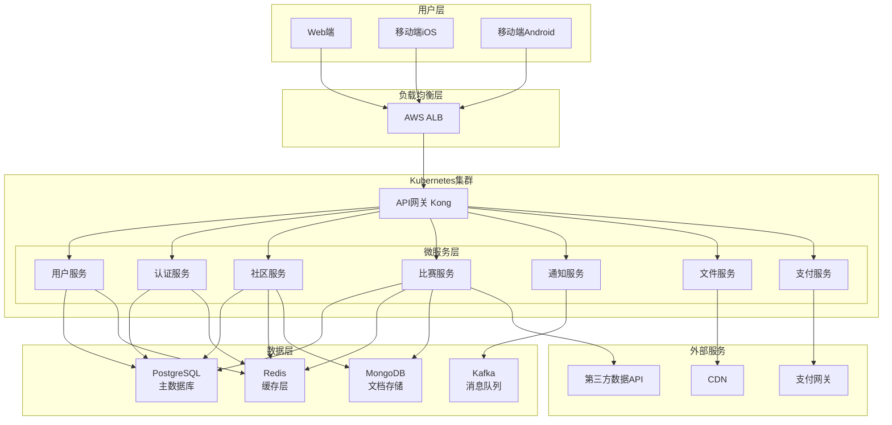
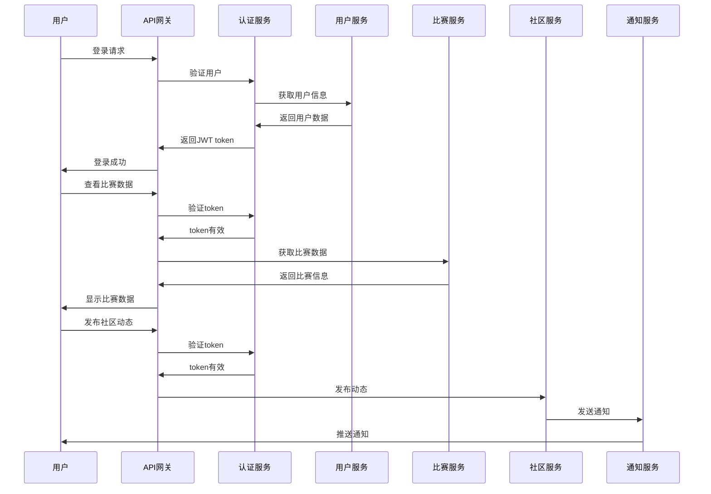
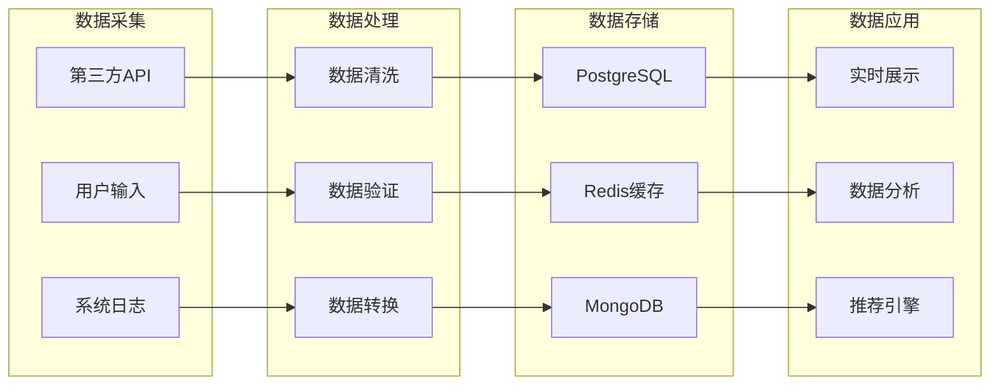
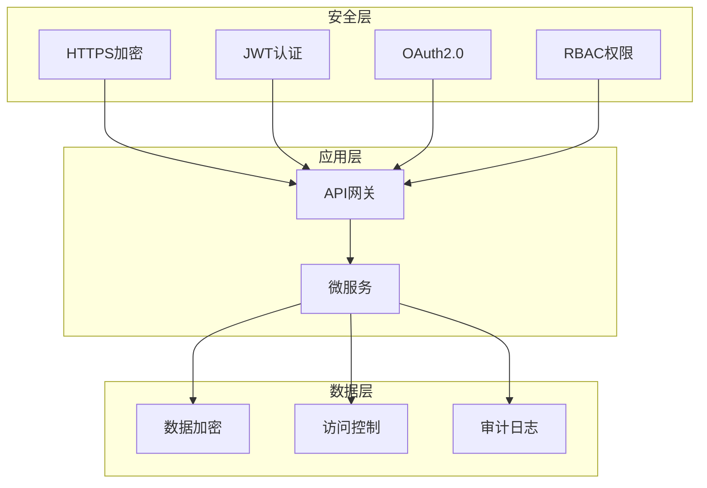

# SOOSCORE 系统架构图

## 整体架构图

```mermaid
graph TB
    subgraph "用户层"
        A[Web端] 
        B[移动端iOS]
        C[移动端Android]
    end
    
    subgraph "负载均衡层"
        D[AWS ALB]
    end
    
    subgraph "Kubernetes集群"
        E[API网关 Kong]
        
        subgraph "微服务层"
            F[用户服务]
            G[认证服务]
            H[社区服务]
            I[比赛服务]
            J[通知服务]
            K[文件服务]
            L[支付服务]
        end
    end
    
    subgraph "数据层"
        M[PostgreSQL<br/>主数据库]
        N[Redis<br/>缓存层]
        O[MongoDB<br/>文档存储]
        P[Kafka<br/>消息队列]
    end
    
    subgraph "外部服务"
        Q[第三方数据API]
        R[支付网关]
        S[CDN]
    end
    
    A --> D
    B --> D
    C --> D
    D --> E
    E --> F
    E --> G
    E --> H
    E --> I
    E --> J
    E --> K
    E --> L
    
    F --> M
    F --> N
    G --> M
    G --> N
    H --> M
    H --> N
    H --> O
    I --> M
    I --> N
    I --> O
    I --> Q
    J --> P
    K --> S
    L --> R
```

## 微服务交互图

```mermaid
sequenceDiagram
    participant U as 用户
    participant G as API网关
    participant A as 认证服务
    participant U2 as 用户服务
    participant M as 比赛服务
    participant C as 社区服务
    participant N as 通知服务
    
    U->>G: 登录请求
    G->>A: 验证用户
    A->>U2: 获取用户信息
    U2->>A: 返回用户数据
    A->>G: 返回JWT token
    G->>U: 登录成功
    
    U->>G: 查看比赛数据
    G->>A: 验证token
    A->>G: token有效
    G->>M: 获取比赛数据
    M->>G: 返回比赛信息
    G->>U: 显示比赛数据
    
    U->>G: 发布社区动态
    G->>A: 验证token
    A->>G: token有效
    G->>C: 发布动态
    C->>N: 发送通知
    N->>U: 推送通知
```

## 数据流架构图

```mermaid
graph LR
    subgraph "数据采集"
        A[第三方API]
        B[用户输入]
        C[系统日志]
    end
    
    subgraph "数据处理"
        D[数据清洗]
        E[数据验证]
        F[数据转换]
    end
    
    subgraph "数据存储"
        G[PostgreSQL]
        H[Redis缓存]
        I[MongoDB]
    end
    
    subgraph "数据应用"
        J[实时展示]
        K[数据分析]
        L[推荐引擎]
    end
    
    A --> D
    B --> E
    C --> F
    D --> G
    E --> H
    F --> I
    G --> J
    H --> K
    I --> L
```

## 安全架构图

```mermaid
graph TB
    subgraph "安全层"
        A[HTTPS加密]
        B[JWT认证]
        C[OAuth2.0]
        D[RBAC权限]
    end
    
    subgraph "应用层"
        E[API网关]
        F[微服务]
    end
    
    subgraph "数据层"
        G[数据加密]
        H[访问控制]
        I[审计日志]
    end
    
    A --> E
    B --> E
    C --> E
    D --> E
    E --> F
    F --> G
    F --> H
    F --> I
```
