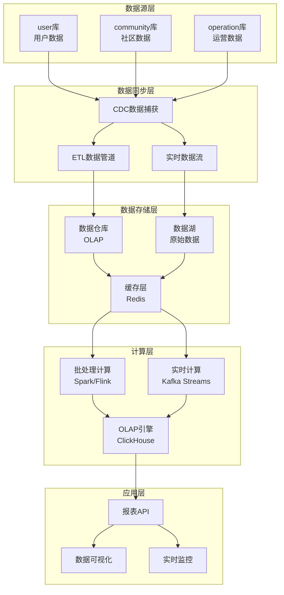

# 多库架构下报表统计技术方案

## 1. 问题分析

### 1.1 现状描述
- **user库**: 用户基础信息、用户行为数据
- **community库**: 社区内容、互动数据、社交关系
- **operation库**: 运营数据、业务指标、系统日志

### 1.2 挑战
- 跨库查询性能问题
- 数据一致性保证
- 实时性要求
- 数据量增长带来的性能瓶颈

## 2. 技术方案架构

### 2.1 整体架构设计



### 2.2 数据分层架构

#### 2.2.1 ODS层 (Operational Data Store)
- **目的**: 原始数据存储，保持数据完整性
- **技术**: MySQL分库 + 数据同步
- **特点**: 接近业务系统，数据更新频繁

#### 2.2.2 DWD层 (Data Warehouse Detail)
- **目的**: 数据清洗和标准化
- **技术**: 数据仓库 (如ClickHouse、Greenplum)
- **特点**: 统一数据模型，去重和清洗

#### 2.2.3 DWS层 (Data Warehouse Summary)
- **目的**: 数据汇总和预计算
- **技术**: OLAP引擎
- **特点**: 按业务主题组织，支持快速查询

#### 2.2.4 ADS层 (Application Data Service)
- **目的**: 应用数据服务
- **技术**: Redis + MySQL
- **特点**: 面向应用，支持实时查询

## 3. 具体技术实现

### 3.1 数据同步方案

#### 3.1.1 实时同步 (CDC)
```yaml
# 使用Canal实现MySQL CDC
canal:
  server:
    mode: tcp
    port: 11111
  instance:
    destination: user_db
    source:
      type: mysql
      host: localhost
      port: 3306
      username: canal
      password: canal
    filter:
      regex: user\\.users,user\\.user_profiles
```

#### 3.1.2 批量同步 (ETL)
```python
# 使用Airflow调度ETL任务
from airflow import DAG
from airflow.operators.python_operator import PythonOperator
from datetime import datetime, timedelta

def extract_user_data():
    """从user库提取数据"""
    # 实现数据提取逻辑
    pass

def extract_community_data():
    """从community库提取数据"""
    # 实现数据提取逻辑
    pass

def extract_operation_data():
    """从operation库提取数据"""
    # 实现数据提取逻辑
    pass

def transform_data():
    """数据转换和清洗"""
    # 实现数据转换逻辑
    pass

def load_to_warehouse():
    """加载到数据仓库"""
    # 实现数据加载逻辑
    pass

# 定义DAG
dag = DAG(
    'multi_db_etl',
    default_args={
        'owner': 'data_team',
        'depends_on_past': False,
        'start_date': datetime(2024, 1, 1),
        'email_on_failure': False,
        'email_on_retry': False,
        'retries': 1,
        'retry_delay': timedelta(minutes=5),
    },
    schedule_interval='0 2 * * *',  # 每天凌晨2点执行
    catchup=False
)

# 定义任务
extract_tasks = [
    PythonOperator(
        task_id=f'extract_{db}',
        python_callable=globals()[f'extract_{db}_data'],
        dag=dag
    ) for db in ['user', 'community', 'operation']
]

transform_task = PythonOperator(
    task_id='transform_data',
    python_callable=transform_data,
    dag=dag
)

load_task = PythonOperator(
    task_id='load_to_warehouse',
    python_callable=load_to_warehouse,
    dag=dag
)

# 设置任务依赖
extract_tasks >> transform_task >> load_task
```

### 3.2 数据仓库设计

#### 3.2.1 星型模型设计
```sql
-- 事实表：用户行为事实表
CREATE TABLE fact_user_behavior (
    id BIGINT PRIMARY KEY,
    user_id BIGINT NOT NULL,
    action_type VARCHAR(50) NOT NULL,
    action_time TIMESTAMP NOT NULL,
    community_id BIGINT,
    operation_id BIGINT,
    amount DECIMAL(10,2),
    -- 维度外键
    dim_date_id INT,
    dim_user_id INT,
    dim_community_id INT,
    dim_operation_id INT
);

-- 维度表：用户维度
CREATE TABLE dim_user (
    id INT PRIMARY KEY,
    user_id BIGINT NOT NULL,
    username VARCHAR(100),
    email VARCHAR(100),
    register_date DATE,
    user_level VARCHAR(20),
    is_active BOOLEAN,
    -- SCD Type 2 字段
    start_date DATE,
    end_date DATE,
    is_current BOOLEAN
);

-- 维度表：日期维度
CREATE TABLE dim_date (
    id INT PRIMARY KEY,
    date_value DATE NOT NULL,
    year INT,
    quarter INT,
    month INT,
    week INT,
    day_of_week INT,
    is_weekend BOOLEAN,
    is_holiday BOOLEAN
);

-- 维度表：社区维度
CREATE TABLE dim_community (
    id INT PRIMARY KEY,
    community_id BIGINT NOT NULL,
    community_name VARCHAR(100),
    category VARCHAR(50),
    member_count INT,
    created_date DATE
);
```

#### 3.2.2 预聚合表设计
```sql
-- 用户日活跃度汇总表
CREATE TABLE agg_user_daily_activity (
    date_id INT,
    user_id BIGINT,
    login_count INT,
    post_count INT,
    comment_count INT,
    like_count INT,
    share_count INT,
    total_online_time INT, -- 秒
    PRIMARY KEY (date_id, user_id)
);

-- 社区日活跃度汇总表
CREATE TABLE agg_community_daily_activity (
    date_id INT,
    community_id BIGINT,
    new_members INT,
    active_members INT,
    new_posts INT,
    total_comments INT,
    total_likes INT,
    PRIMARY KEY (date_id, community_id)
);

-- 运营指标日汇总表
CREATE TABLE agg_operation_daily_metrics (
    date_id INT,
    metric_type VARCHAR(50),
    metric_value DECIMAL(15,2),
    additional_data JSON,
    PRIMARY KEY (date_id, metric_type)
);
```

### 3.3 实时计算方案

#### 3.3.1 Kafka Streams实时处理
```java
// 实时用户行为统计
public class UserBehaviorProcessor {
    
    @StreamListener("user-behavior-topic")
    public void processUserBehavior(UserBehaviorEvent event) {
        // 实时更新用户活跃度
        updateUserActivity(event.getUserId(), event.getActionType());
        
        // 实时更新社区活跃度
        if (event.getCommunityId() != null) {
            updateCommunityActivity(event.getCommunityId(), event.getActionType());
        }
        
        // 发送到下游系统
        kafkaTemplate.send("processed-behavior-topic", event);
    }
    
    private void updateUserActivity(Long userId, String actionType) {
        // 更新Redis中的实时统计
        String key = "user:activity:" + userId + ":" + getCurrentDate();
        redisTemplate.opsForHash().increment(key, actionType, 1);
        redisTemplate.expire(key, Duration.ofDays(7));
    }
}
```

#### 3.3.2 Flink实时计算
```java
// 使用Flink进行实时数据流处理
public class RealTimeAnalyticsJob {
    
    public static void main(String[] args) throws Exception {
        StreamExecutionEnvironment env = StreamExecutionEnvironment.getExecutionEnvironment();
        
        // 从Kafka读取数据
        DataStream<UserBehaviorEvent> userBehaviorStream = env
            .addSource(new FlinkKafkaConsumer<>("user-behavior-topic", 
                new UserBehaviorEventDeserializer(), kafkaProps));
        
        // 实时计算用户活跃度
        DataStream<UserActivitySummary> userActivityStream = userBehaviorStream
            .keyBy(UserBehaviorEvent::getUserId)
            .window(TumblingProcessingTimeWindows.of(Time.minutes(5)))
            .aggregate(new UserActivityAggregator());
        
        // 输出到ClickHouse
        userActivityStream.addSink(new ClickHouseSink());
        
        env.execute("RealTimeAnalyticsJob");
    }
}
```

### 3.4 报表API设计

#### 3.4.1 RESTful API接口
```python
from fastapi import FastAPI, Depends, HTTPException
from sqlalchemy.orm import Session
from typing import List, Optional
from datetime import datetime, date

app = FastAPI(title="报表统计API")

@app.get("/api/reports/user-activity")
async def get_user_activity_report(
    start_date: date,
    end_date: date,
    user_id: Optional[int] = None,
    group_by: str = "day",
    db: Session = Depends(get_db)
):
    """获取用户活跃度报表"""
    query = """
    SELECT 
        d.date_value,
        COUNT(DISTINCT f.user_id) as active_users,
        SUM(CASE WHEN f.action_type = 'login' THEN 1 ELSE 0 END) as login_count,
        SUM(CASE WHEN f.action_type = 'post' THEN 1 ELSE 0 END) as post_count
    FROM fact_user_behavior f
    JOIN dim_date d ON f.dim_date_id = d.id
    WHERE d.date_value BETWEEN :start_date AND :end_date
    """
    
    if user_id:
        query += " AND f.user_id = :user_id"
    
    if group_by == "day":
        query += " GROUP BY d.date_value ORDER BY d.date_value"
    elif group_by == "week":
        query += " GROUP BY d.year, d.week ORDER BY d.year, d.week"
    elif group_by == "month":
        query += " GROUP BY d.year, d.month ORDER BY d.year, d.month"
    
    result = db.execute(text(query), {
        "start_date": start_date,
        "end_date": end_date,
        "user_id": user_id
    }).fetchall()
    
    return [dict(row) for row in result]

@app.get("/api/reports/community-activity")
async def get_community_activity_report(
    start_date: date,
    end_date: date,
    community_id: Optional[int] = None,
    db: Session = Depends(get_db)
):
    """获取社区活跃度报表"""
    # 实现社区活跃度统计逻辑
    pass

@app.get("/api/reports/operation-metrics")
async def get_operation_metrics_report(
    start_date: date,
    end_date: date,
    metric_type: Optional[str] = None,
    db: Session = Depends(get_db)
):
    """获取运营指标报表"""
    # 实现运营指标统计逻辑
    pass
```

#### 3.4.2 GraphQL API设计
```python
import graphene
from graphene_sqlalchemy import SQLAlchemyObjectType, SQLAlchemyConnectionField

class UserActivityType(graphene.ObjectType):
    date = graphene.Date()
    active_users = graphene.Int()
    login_count = graphene.Int()
    post_count = graphene.Int()

class CommunityActivityType(graphene.ObjectType):
    date = graphene.Date()
    community_name = graphene.String()
    new_members = graphene.Int()
    active_members = graphene.Int()
    new_posts = graphene.Int()

class Query(graphene.ObjectType):
    user_activity_report = graphene.List(
        UserActivityType,
        start_date=graphene.Date(required=True),
        end_date=graphene.Date(required=True),
        user_id=graphene.Int()
    )
    
    community_activity_report = graphene.List(
        CommunityActivityType,
        start_date=graphene.Date(required=True),
        end_date=graphene.Date(required=True),
        community_id=graphene.Int()
    )
    
    def resolve_user_activity_report(self, info, start_date, end_date, user_id=None):
        # 实现用户活跃度报表查询
        pass
    
    def resolve_community_activity_report(self, info, start_date, end_date, community_id=None):
        # 实现社区活跃度报表查询
        pass

schema = graphene.Schema(query=Query)
```

### 3.5 缓存策略

#### 3.5.1 Redis缓存设计
```python
import redis
import json
from datetime import datetime, timedelta

class ReportCache:
    def __init__(self):
        self.redis_client = redis.Redis(host='localhost', port=6379, db=0)
    
    def get_user_activity_cache(self, user_id, date_range):
        """获取用户活跃度缓存"""
        cache_key = f"report:user_activity:{user_id}:{date_range}"
        cached_data = self.redis_client.get(cache_key)
        
        if cached_data:
            return json.loads(cached_data)
        return None
    
    def set_user_activity_cache(self, user_id, date_range, data, ttl=3600):
        """设置用户活跃度缓存"""
        cache_key = f"report:user_activity:{user_id}:{date_range}"
        self.redis_client.setex(
            cache_key, 
            ttl, 
            json.dumps(data, default=str)
        )
    
    def invalidate_user_cache(self, user_id):
        """失效用户相关缓存"""
        pattern = f"report:user_activity:{user_id}:*"
        keys = self.redis_client.keys(pattern)
        if keys:
            self.redis_client.delete(*keys)
```

#### 3.5.2 多级缓存策略
```python
class MultiLevelCache:
    def __init__(self):
        self.l1_cache = {}  # 本地缓存
        self.l2_cache = redis.Redis()  # Redis缓存
        self.l3_cache = None  # 数据库查询
    
    def get_data(self, key):
        # L1缓存
        if key in self.l1_cache:
            return self.l1_cache[key]
        
        # L2缓存
        data = self.l2_cache.get(key)
        if data:
            self.l1_cache[key] = json.loads(data)
            return self.l1_cache[key]
        
        # L3数据库查询
        data = self.query_database(key)
        if data:
            self.l2_cache.setex(key, 3600, json.dumps(data, default=str))
            self.l1_cache[key] = data
        
        return data
```

## 4. 性能优化方案

### 4.1 数据库优化

#### 4.1.1 索引优化
```sql
-- 为报表查询创建复合索引
CREATE INDEX idx_fact_user_behavior_date_user 
ON fact_user_behavior (dim_date_id, user_id, action_type);

CREATE INDEX idx_fact_user_behavior_community_date 
ON fact_user_behavior (community_id, dim_date_id, action_type);

-- 为维度表创建索引
CREATE INDEX idx_dim_user_active 
ON dim_user (is_active, user_level, register_date);

CREATE INDEX idx_dim_date_range 
ON dim_date (date_value, year, month);
```

#### 4.1.2 分区表设计
```sql
-- 按日期分区事实表
CREATE TABLE fact_user_behavior (
    id BIGINT,
    user_id BIGINT,
    action_type VARCHAR(50),
    action_time TIMESTAMP,
    -- 其他字段...
    PRIMARY KEY (id, action_time)
) PARTITION BY RANGE (action_time) (
    PARTITION p202401 VALUES LESS THAN ('2024-02-01'),
    PARTITION p202402 VALUES LESS THAN ('2024-03-01'),
    PARTITION p202403 VALUES LESS THAN ('2024-04-01')
    -- 按月分区
);
```

### 4.2 查询优化

#### 4.2.1 预计算策略
```python
# 使用Celery进行异步预计算
from celery import Celery

app = Celery('report_tasks')

@app.task
def precompute_daily_reports(date):
    """预计算日报表"""
    # 计算用户活跃度
    user_activity = compute_user_activity(date)
    
    # 计算社区活跃度
    community_activity = compute_community_activity(date)
    
    # 计算运营指标
    operation_metrics = compute_operation_metrics(date)
    
    # 存储预计算结果
    store_precomputed_results(date, {
        'user_activity': user_activity,
        'community_activity': community_activity,
        'operation_metrics': operation_metrics
    })

# 定时任务
from celery.schedules import crontab

app.conf.beat_schedule = {
    'daily-report-computation': {
        'task': 'precompute_daily_reports',
        'schedule': crontab(hour=1, minute=0),  # 每天凌晨1点执行
    },
}
```

#### 4.2.2 查询重写和优化
```python
class QueryOptimizer:
    def optimize_report_query(self, query, params):
        """查询优化"""
        # 1. 添加必要的索引提示
        if 'date_range' in params:
            query = self.add_date_index_hint(query)
        
        # 2. 重写子查询为JOIN
        query = self.rewrite_subqueries(query)
        
        # 3. 添加查询缓存
        cache_key = self.generate_cache_key(query, params)
        cached_result = self.get_cached_result(cache_key)
        if cached_result:
            return cached_result
        
        # 4. 执行查询
        result = self.execute_query(query, params)
        
        # 5. 缓存结果
        self.cache_result(cache_key, result)
        
        return result
```

## 5. 监控和运维

### 5.1 数据质量监控
```python
class DataQualityMonitor:
    def check_data_completeness(self):
        """检查数据完整性"""
        # 检查各库数据量
        user_count = self.get_user_db_count()
        community_count = self.get_community_db_count()
        operation_count = self.get_operation_db_count()
        
        # 检查数据同步延迟
        sync_delay = self.check_sync_delay()
        
        # 检查数据一致性
        consistency_check = self.check_data_consistency()
        
        return {
            'user_count': user_count,
            'community_count': community_count,
            'operation_count': operation_count,
            'sync_delay': sync_delay,
            'consistency_check': consistency_check
        }
    
    def check_data_accuracy(self):
        """检查数据准确性"""
        # 检查数据范围
        # 检查数据格式
        # 检查业务规则
        pass
```

### 5.2 性能监控
```python
class PerformanceMonitor:
    def monitor_query_performance(self):
        """监控查询性能"""
        # 慢查询监控
        slow_queries = self.get_slow_queries()
        
        # 查询执行时间统计
        execution_times = self.get_execution_times()
        
        # 资源使用情况
        resource_usage = self.get_resource_usage()
        
        return {
            'slow_queries': slow_queries,
            'execution_times': execution_times,
            'resource_usage': resource_usage
        }
```

## 6. 实施计划

### 6.1 第一阶段：基础建设 (1-2个月)
- [ ] 搭建数据同步基础设施
- [ ] 设计数据仓库模型
- [ ] 实现基础ETL流程
- [ ] 建立数据质量监控

### 6.2 第二阶段：核心功能 (2-3个月)
- [ ] 实现实时数据同步
- [ ] 开发报表API接口
- [ ] 建立缓存机制
- [ ] 实现基础报表功能

### 6.3 第三阶段：优化提升 (1-2个月)
- [ ] 性能优化和调优
- [ ] 高级报表功能
- [ ] 数据可视化
- [ ] 监控告警完善

### 6.4 第四阶段：扩展应用 (持续)
- [ ] 机器学习集成
- [ ] 实时推荐系统
- [ ] 高级分析功能
- [ ] 业务智能应用

## 7. 技术选型建议

### 7.1 数据同步工具
- **Canal**: MySQL CDC，实时数据捕获
- **DataX**: 阿里开源ETL工具，支持多种数据源
- **Airflow**: 工作流调度，支持复杂ETL流程

### 7.2 数据存储
- **ClickHouse**: OLAP数据库，适合分析查询
- **Greenplum**: 分布式数据仓库
- **Redis**: 缓存和实时数据存储

### 7.3 计算引擎
- **Spark**: 批处理计算
- **Flink**: 流处理计算
- **Kafka Streams**: 轻量级流处理

### 7.4 可视化工具
- **Grafana**: 监控和可视化
- **Superset**: 开源BI工具
- **自研Dashboard**: 定制化报表界面

## 8. 成本评估

### 8.1 基础设施成本
- **服务器资源**: 预估每月2-5万元
- **存储成本**: 预估每月1-3万元
- **网络成本**: 预估每月0.5-1万元

### 8.2 人力成本
- **数据工程师**: 2-3人
- **后端开发**: 2-3人
- **运维工程师**: 1-2人

### 8.3 软件许可成本
- **商业软件**: 根据选型确定
- **开源软件**: 主要是运维成本

## 9. 风险评估和应对

### 9.1 技术风险
- **数据一致性风险**: 通过事务和补偿机制解决
- **性能瓶颈风险**: 通过分库分表和缓存解决
- **数据安全风险**: 通过加密和权限控制解决

### 9.2 业务风险
- **数据延迟风险**: 通过实时同步和监控解决
- **数据质量风险**: 通过数据质量监控和清洗解决
- **系统可用性风险**: 通过高可用架构和容灾解决

## 10. 总结

本技术方案提供了多库架构下报表统计的完整解决方案，包括：

1. **数据同步**: CDC + ETL双重保障
2. **数据存储**: 分层架构，支持不同查询需求
3. **计算处理**: 批处理 + 流处理结合
4. **API服务**: RESTful + GraphQL双接口
5. **性能优化**: 缓存 + 预计算 + 索引优化
6. **监控运维**: 全链路监控和告警

该方案具有良好的扩展性和可维护性，能够满足当前和未来的业务需求。
