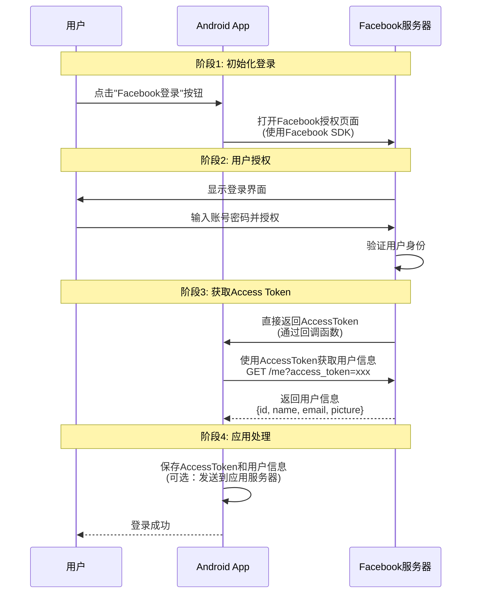
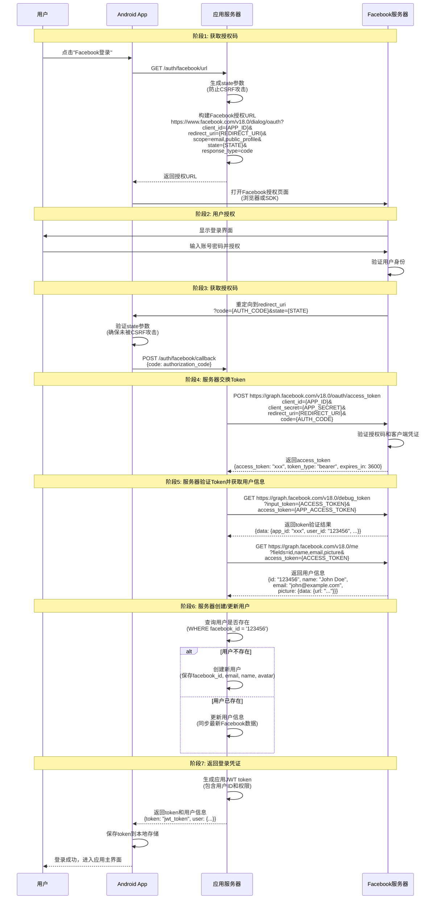
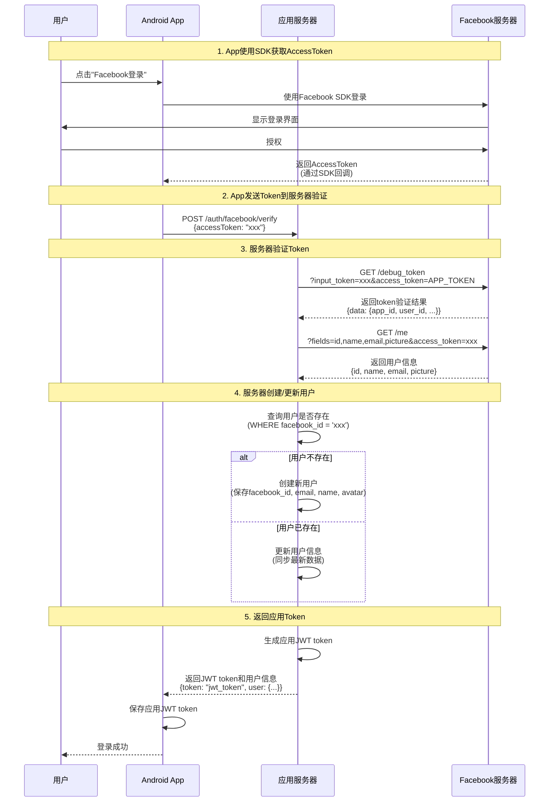

# Facebook登录实现方式详解

本文档详细说明Facebook Android登录的两种实现方式：客户端直接登录和服务器端登录，以及为什么官方文档没有提到应用服务器。

---

## Facebook Android登录的两种方式

根据 [Facebook Android 登录文档](https://developers.facebook.com/docs/facebook-login/android#check-login)，Facebook SDK默认使用**客户端直接登录（Client-side flow）**，不需要应用服务器参与。但同时也支持**服务器端登录（Server-side flow）**，这种方式更安全。

---

## 方式1：客户端直接登录（Client-side Flow）——官方文档中的方式

这是Facebook SDK的默认方式，也是官方文档中展示的方式。整个流程在客户端完成，不需要应用服务器参与。

### 流程时序图



### 实现代码示例

```kotlin
// 1. 添加Facebook Login Button到布局
// activity_main.xml
<com.facebook.login.widget.LoginButton
    android:id="@+id/login_button"
    android:layout_width="wrap_content"
    android:layout_height="wrap_content" />

// 2. 在Activity中注册回调
class MainActivity : AppCompatActivity() {
    private lateinit var callbackManager: CallbackManager
    
    override fun onCreate(savedInstanceState: Bundle?) {
        super.onCreate(savedInstanceState)
        setContentView(R.layout.activity_main)
        
        callbackManager = CallbackManager.Factory.create()
        
        val loginButton = findViewById<LoginButton>(R.id.login_button)
        loginButton.setReadPermissions(listOf("email", "public_profile"))
        
        loginButton.registerCallback(callbackManager, object : FacebookCallback<LoginResult> {
            override fun onSuccess(loginResult: LoginResult) {
                // 直接获取AccessToken
                val accessToken = loginResult.accessToken
                
                // 使用AccessToken获取用户信息
                val request = GraphRequest.newMeRequest(
                    accessToken
                ) { obj, response ->
                    val userInfo = response.jsonObject
                    val userId = userInfo.getString("id")
                    val name = userInfo.getString("name")
                    val email = userInfo.getString("email")
                    
                    // 可选：将token发送到应用服务器验证
                    // sendTokenToServer(accessToken.tokenString)
                }
                
                val parameters = Bundle()
                parameters.putString("fields", "id,name,email,picture")
                request.parameters = parameters
                request.executeAsync()
            }
            
            override fun onCancel() {
                // 用户取消登录
            }
            
            override fun onError(exception: FacebookException) {
                // 登录失败
            }
        })
    }
    
    override fun onActivityResult(requestCode: Int, resultCode: Int, data: Intent?) {
        callbackManager.onActivityResult(requestCode, resultCode, data)
        super.onActivityResult(requestCode, resultCode, data)
    }
}
```

### 特点

- ✅ **不需要应用服务器参与**：整个流程在客户端完成
- ✅ **App直接获取AccessToken**：通过SDK回调直接获得token
- ✅ **使用SDK封装**：使用`LoginManager`或`LoginButton`，流程简单
- ✅ **快速集成**：适合快速验证和原型开发

### 工作原理

1. **SDK处理授权流程**：Facebook SDK内部处理OAuth 2.0授权流程
2. **直接返回Token**：授权成功后，SDK直接返回`AccessToken`给App
3. **App直接调用API**：App可以使用`AccessToken`直接调用Facebook Graph API获取用户信息
4. **可选服务器验证**：App可以选择是否将token发送到应用服务器进行验证

### 安全性考虑

- ⚠️ **Token在客户端**：AccessToken存储在客户端，存在泄露风险
- ⚠️ **无法使用Client Secret**：客户端无法安全地使用`client_secret`进行验证
- ⚠️ **Token验证困难**：客户端难以验证token的有效性和真实性

---

## 方式2：服务器端登录（Server-side Flow）——更安全的方式

如果需要更高的安全性，或者需要将用户数据持久化到应用服务器，应该使用服务器端登录流程。

### 流程时序图



### 服务器端实现示例

#### 服务器端（Node.js示例）

```javascript
// 1. 生成授权URL
app.get('/auth/facebook/url', (req, res) => {
  const state = generateRandomString(); // 防止CSRF攻击
  req.session.facebookState = state;
  
  const authUrl = `https://www.facebook.com/v18.0/dialog/oauth?` +
    `client_id=${FACEBOOK_APP_ID}&` +
    `redirect_uri=${encodeURIComponent(REDIRECT_URI)}&` +
    `scope=email,public_profile&` +
    `state=${state}&` +
    `response_type=code`;
  
  res.json({ authUrl });
});

// 2. 处理授权回调
app.post('/auth/facebook/callback', async (req, res) => {
  const { code, state } = req.body;
  
  // 验证state参数
  if (state !== req.session.facebookState) {
    return res.status(400).json({ error: 'Invalid state parameter' });
  }
  
  try {
    // 3. 使用授权码换取access_token
    const tokenResponse = await axios.post(
      'https://graph.facebook.com/v18.0/oauth/access_token',
      {
        client_id: FACEBOOK_APP_ID,
        client_secret: FACEBOOK_APP_SECRET,
        redirect_uri: REDIRECT_URI,
        code: code
      }
    );
    
    const { access_token } = tokenResponse.data;
    
    // 4. 验证token有效性
    const debugResponse = await axios.get(
      'https://graph.facebook.com/v18.0/debug_token',
      {
        params: {
          input_token: access_token,
          access_token: `${FACEBOOK_APP_ID}|${FACEBOOK_APP_SECRET}`
        }
      }
    );
    
    // 5. 获取用户信息
    const userResponse = await axios.get(
      'https://graph.facebook.com/v18.0/me',
      {
        params: {
          fields: 'id,name,email,picture',
          access_token: access_token
        }
      }
    );
    
    const userInfo = userResponse.data;
    
    // 6. 创建或更新用户
    let user = await User.findOne({ facebook_id: userInfo.id });
    if (!user) {
      user = await User.create({
        facebook_id: userInfo.id,
        email: userInfo.email,
        name: userInfo.name,
        avatar: userInfo.picture?.data?.url
      });
    } else {
      user.email = userInfo.email;
      user.name = userInfo.name;
      user.avatar = userInfo.picture?.data?.url;
      await user.save();
    }
    
    // 7. 生成应用JWT token
    const jwtToken = generateJWT(user.id);
    
    res.json({
      token: jwtToken,
      user: {
        id: user.id,
        email: user.email,
        name: user.name
      }
    });
  } catch (error) {
    res.status(500).json({ error: 'Facebook login failed' });
  }
});
```

#### 客户端实现示例

```kotlin
// Android App端实现
class FacebookLoginActivity : AppCompatActivity() {
    private val webView = WebView(this)
    
    fun loginWithFacebook() {
        // 1. 从服务器获取授权URL
        val request = Request.Builder()
            .url("${SERVER_URL}/auth/facebook/url")
            .build()
        
        client.newCall(request).enqueue(object : Callback {
            override fun onResponse(call: Call, response: Response) {
                val json = JSONObject(response.body()?.string())
                val authUrl = json.getString("authUrl")
                
                // 2. 在WebView中打开授权URL
                runOnUiThread {
                    webView.loadUrl(authUrl)
                    webView.webViewClient = object : WebViewClient() {
                        override fun shouldOverrideUrlLoading(
                            view: WebView?,
                            request: WebResourceRequest?
                        ): Boolean {
                            val url = request?.url.toString()
                            
                            // 3. 检测重定向URL，提取授权码
                            if (url.startsWith(REDIRECT_URI)) {
                                val uri = Uri.parse(url)
                                val code = uri.getQueryParameter("code")
                                val state = uri.getQueryParameter("state")
                                
                                // 4. 发送授权码到服务器
                                sendCodeToServer(code, state)
                                return true
                            }
                            return false
                        }
                    }
                }
            }
            
            override fun onFailure(call: Call, e: IOException) {
                // 处理错误
            }
        })
    }
    
    private fun sendCodeToServer(code: String, state: String) {
        val json = JSONObject()
        json.put("code", code)
        json.put("state", state)
        
        val request = Request.Builder()
            .url("${SERVER_URL}/auth/facebook/callback")
            .post(RequestBody.create(MediaType.parse("application/json"), json.toString()))
            .build()
        
        client.newCall(request).enqueue(object : Callback {
            override fun onResponse(call: Call, response: Response) {
                val result = JSONObject(response.body()?.string())
                val token = result.getString("token")
                val user = result.getJSONObject("user")
                
                // 5. 保存token和用户信息
                saveTokenAndUser(token, user)
            }
            
            override fun onFailure(call: Call, e: IOException) {
                // 处理错误
            }
        })
    }
}
```

### 特点

- ✅ **安全性高**：`client_secret`只在服务器端使用，不会泄露
- ✅ **Token验证**：服务器可以验证token的有效性和真实性
- ✅ **用户数据管理**：服务器统一管理用户数据，建立账户体系
- ✅ **应用Token**：服务器生成应用自己的JWT token，便于后续API调用

### 安全性优势

- 🔒 **Client Secret保护**：`client_secret`只在服务器端使用，不会暴露在客户端
- 🔒 **Token验证**：使用`debug_token`端点验证token的有效性和所属应用
- 🔒 **State参数**：防止CSRF攻击，确保请求未被篡改
- 🔒 **统一账户体系**：服务器管理用户数据，便于多平台登录

---

## 推荐做法：混合方式（Hybrid Approach）

结合两种方式的优点，推荐使用混合方式：

1. **使用Facebook SDK简化客户端流程**：利用SDK的便捷性
2. **服务器验证Token**：确保安全性和数据一致性
3. **服务器管理用户数据**：统一账户体系

### 混合方式流程时序图



### 混合方式实现示例

#### 客户端代码

```kotlin
class FacebookLoginActivity : AppCompatActivity() {
    private lateinit var callbackManager: CallbackManager
    
    override fun onCreate(savedInstanceState: Bundle?) {
        super.onCreate(savedInstanceState)
        
        callbackManager = CallbackManager.Factory.create()
        
        val loginButton = findViewById<LoginButton>(R.id.login_button)
        loginButton.setReadPermissions(listOf("email", "public_profile"))
        
        loginButton.registerCallback(callbackManager, object : FacebookCallback<LoginResult> {
            override fun onSuccess(loginResult: LoginResult) {
                // 1. 获取AccessToken
                val accessToken = loginResult.accessToken.tokenString
                
                // 2. 发送到服务器验证
                verifyTokenWithServer(accessToken)
            }
            
            override fun onCancel() {
                // 用户取消
            }
            
            override fun onError(exception: FacebookException) {
                // 登录失败
            }
        })
    }
    
    private fun verifyTokenWithServer(accessToken: String) {
        val json = JSONObject()
        json.put("accessToken", accessToken)
        
        val request = Request.Builder()
            .url("${SERVER_URL}/auth/facebook/verify")
            .post(RequestBody.create(MediaType.parse("application/json"), json.toString()))
            .build()
        
        client.newCall(request).enqueue(object : Callback {
            override fun onResponse(call: Call, response: Response) {
                val result = JSONObject(response.body()?.string())
                val jwtToken = result.getString("token")
                val user = result.getJSONObject("user")
                
                // 3. 保存应用JWT token
                saveAppToken(jwtToken)
                // 登录成功
            }
            
            override fun onFailure(call: Call, e: IOException) {
                // 处理错误
            }
        })
    }
}
```

#### 服务器端代码

```javascript
// 服务器端验证Token
app.post('/auth/facebook/verify', async (req, res) => {
  const { accessToken } = req.body;
  
  try {
    // 1. 验证token有效性
    const debugResponse = await axios.get(
      'https://graph.facebook.com/v18.0/debug_token',
      {
        params: {
          input_token: accessToken,
          access_token: `${FACEBOOK_APP_ID}|${FACEBOOK_APP_SECRET}`
        }
      }
    );
    
    const tokenData = debugResponse.data.data;
    
    // 验证token是否属于本应用
    if (tokenData.app_id !== FACEBOOK_APP_ID) {
      return res.status(400).json({ error: 'Invalid token' });
    }
    
    // 2. 获取用户信息
    const userResponse = await axios.get(
      'https://graph.facebook.com/v18.0/me',
      {
        params: {
          fields: 'id,name,email,picture',
          access_token: accessToken
        }
      }
    );
    
    const userInfo = userResponse.data;
    
    // 3. 创建或更新用户
    let user = await User.findOne({ facebook_id: userInfo.id });
    if (!user) {
      user = await User.create({
        facebook_id: userInfo.id,
        email: userInfo.email,
        name: userInfo.name,
        avatar: userInfo.picture?.data?.url
      });
    } else {
      user.email = userInfo.email;
      user.name = userInfo.name;
      user.avatar = userInfo.picture?.data?.url;
      await user.save();
    }
    
    // 4. 生成应用JWT token
    const jwtToken = generateJWT(user.id);
    
    res.json({
      token: jwtToken,
      user: {
        id: user.id,
        email: user.email,
        name: user.name
      }
    });
  } catch (error) {
    res.status(500).json({ error: 'Token verification failed' });
  }
});
```

### 混合方式的优势

- ✅ **利用SDK便捷性**：使用Facebook SDK简化客户端实现
- ✅ **服务器验证安全性**：服务器验证token，确保安全性
- ✅ **统一账户管理**：服务器管理用户数据，便于多平台登录
- ✅ **应用Token体系**：服务器生成应用自己的JWT token，便于后续API调用

---

## 两种方式对比

| 特性 | 客户端直接登录 | 服务器端登录 | 混合方式 |
|------|---------------|------------|---------|
| **应用服务器** | 不需要 | 必需 | 必需 |
| **Client Secret** | 不暴露 | 在服务器端使用 | 在服务器端使用 |
| **安全性** | 较低（token在客户端） | 高（token在服务器） | 高（token在服务器） |
| **实现复杂度** | 简单 | 较复杂 | 中等 |
| **适用场景** | 仅身份验证 | 需要持久化用户数据 | 生产环境推荐 |
| **Token验证** | 客户端验证 | 服务器验证 | 服务器验证 |
| **用户数据管理** | 客户端管理 | 服务器管理 | 服务器管理 |
| **SDK使用** | 使用SDK | 手动实现 | 使用SDK |

---

## 为什么官方文档没有提到应用服务器？

1. **简化流程**：官方文档主要展示最基础的客户端直接登录方式，让开发者快速上手
2. **SDK封装**：Facebook SDK已经封装了授权流程，App可以直接获取token，不需要理解OAuth 2.0的底层细节
3. **服务器可选**：客户端直接登录方式下，应用服务器是可选的，App可以选择是否将token发送到服务器验证

---

## 实际应用建议

### 开发阶段
- 使用**客户端直接登录**方式快速验证和原型开发

### 生产环境
- 使用**混合方式**：
  1. 客户端使用Facebook SDK获取token
  2. 将token发送到应用服务器验证
  3. 服务器验证token并管理用户数据
  4. 服务器生成应用自己的JWT token返回给客户端

### 安全最佳实践

1. **永远不要将Client Secret暴露在客户端**
2. **服务器端验证所有token**
3. **使用State参数防止CSRF攻击**
4. **定期检查token有效性**
5. **实现token刷新机制**
6. **记录所有登录事件，便于审计**

---

## 总结

- **官方文档展示的是客户端直接登录**：App直接获取token，不需要应用服务器
- **这种方式适合快速验证**：简单快速，适合原型开发
- **生产环境推荐混合方式**：使用SDK获取token，服务器验证token并管理用户数据
- **安全性考虑**：生产环境必须使用服务器端验证，确保token安全性和用户数据一致性

---

## 参考资料

- [Facebook Android Login Documentation](https://developers.facebook.com/docs/facebook-login/android)
- [Facebook Login for Android - Quickstart](https://developers.facebook.com/docs/facebook-login/android#check-login)
- [Facebook Graph API Documentation](https://developers.facebook.com/docs/graph-api)
- [OAuth 2.0 Specification](https://oauth.net/2/)


