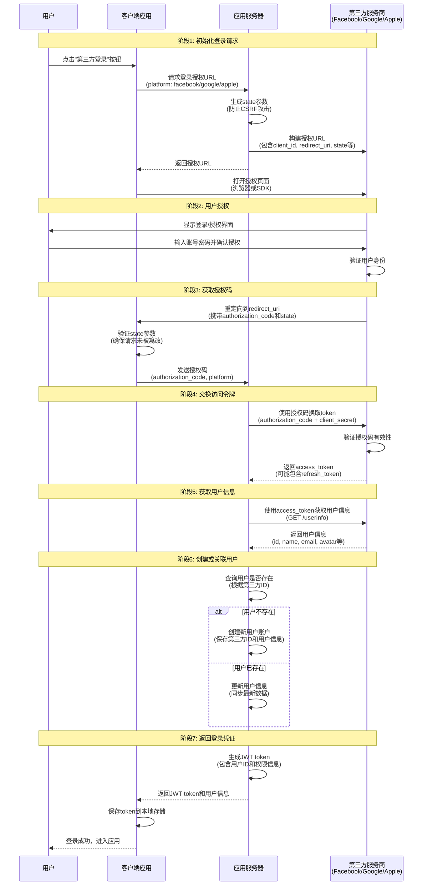
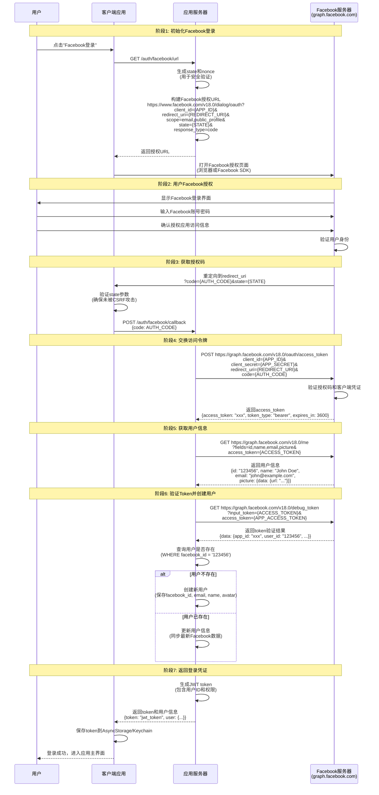
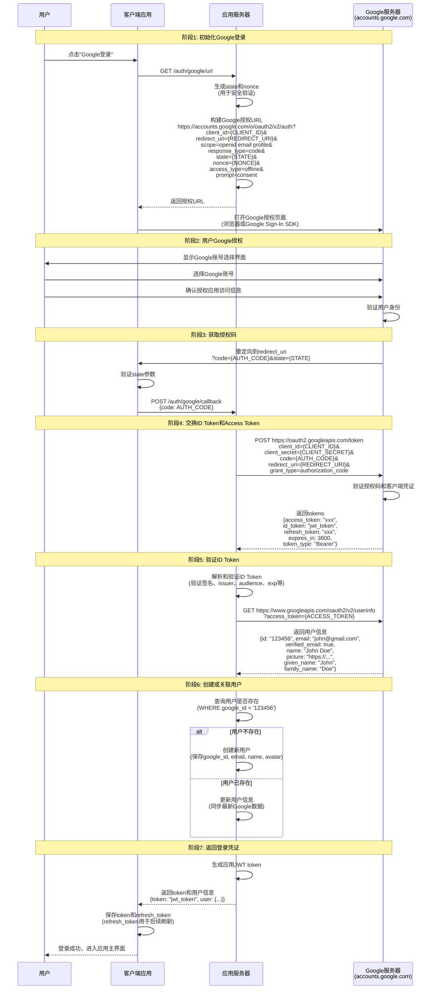
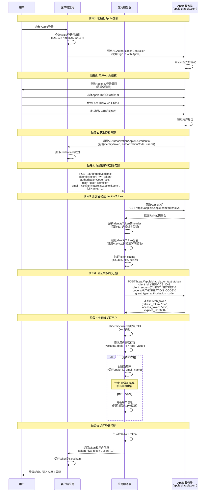

# 第三方登录时序图

本文档包含第三方登录的通用流程以及Facebook、Google、Apple三种主流第三方登录的详细时序图。

---

## 1. 第三方登录通用流程时序图

### 通用流程关键部分说明

#### 阶段1: 初始化登录请求
- **State参数**: 随机生成的字符串，用于防止CSRF攻击。服务器保存state值与session关联，后续验证时必须匹配。
- **授权URL构建**: 包含client_id（应用标识）、redirect_uri（回调地址）、scope（请求权限范围）、state（防攻击参数）等。

#### 阶段2: 用户授权
- **授权界面**: 第三方服务商显示登录界面，用户输入账号密码。
- **权限确认**: 用户确认是否授权应用访问其基本信息（姓名、邮箱、头像等）。

#### 阶段3: 获取授权码
- **State验证**: 客户端必须验证返回的state参数是否与请求时一致，防止CSRF攻击。
- **授权码**: 一次性使用的临时凭证，有效期通常很短（如10分钟）。

#### 阶段4: 交换访问令牌
- **Token交换**: 服务器端使用authorization_code + client_secret向第三方换取access_token。
- **访问令牌**: 用于后续API调用的凭证，有效期较长（通常1-2小时）。
- **刷新令牌**: 部分平台提供refresh_token，用于在access_token过期后获取新的访问令牌。

#### 阶段5: 获取用户信息
- **API调用**: 使用access_token调用第三方提供的用户信息API。
- **信息范围**: 根据授权时请求的scope，获取相应的用户信息字段。

#### 阶段6: 创建或关联用户
- **用户匹配**: 根据第三方提供的唯一ID（如Facebook ID）查询数据库中是否已存在该用户。
- **账号绑定**: 如果用户已存在，将第三方账号与现有账号关联；如果不存在，创建新用户。

#### 阶段7: 返回登录凭证
- **JWT生成**: 服务器生成包含用户身份信息的JWT token，用于后续API请求的身份验证。
- **本地存储**: 客户端保存token，后续请求携带token进行身份验证。

---

## 2. Facebook第三方登录时序图

### Facebook登录关键部分说明

#### Facebook OAuth 2.0流程
- **授权端点**: `https://www.facebook.com/v18.0/dialog/oauth`
- **Token端点**: `https://graph.facebook.com/v18.0/oauth/access_token`
- **API版本**: Facebook使用版本化API，当前推荐使用v18.0或更高版本。

#### 授权范围(Scope)
- **public_profile**: 基础公开信息（姓名、头像）
- **email**: 用户邮箱地址（需要应用审核）
- **user_friends**: 好友列表（需要额外审核）
- **其他权限**: 根据应用需求申请相应权限

#### 安全特性
- **State参数**: 防止CSRF攻击，必须验证返回的state与请求时一致。
- **App Secret**: 客户端密钥必须在服务器端使用，绝不能暴露在客户端代码中。
- **Token验证**: 使用`debug_token`端点验证token的有效性和所属应用。

#### 用户信息获取
- **Graph API**: 使用Facebook Graph API获取用户信息，端点：`/me`
- **字段选择**: 通过`fields`参数指定需要获取的字段，减少不必要的数据传输。
- **头像URL**: Facebook头像URL可能包含临时token，需要定期刷新。

#### 错误处理
- **用户取消**: 用户可能取消授权，需要优雅处理。
- **Token过期**: access_token有效期通常1-2小时，需要实现刷新机制或重新授权。
- **权限拒绝**: 用户可能拒绝某些权限请求，需要降级处理。

---

## 3. Google第三方登录时序图

### Google登录关键部分说明

#### Google OAuth 2.0 + OpenID Connect
- **授权端点**: `https://accounts.google.com/o/oauth2/v2/auth`
- **Token端点**: `https://oauth2.googleapis.com/token`
- **用户信息端点**: `https://www.googleapis.com/oauth2/v2/userinfo`
- **OpenID Connect**: Google使用OIDC协议，提供ID Token用于身份验证。

#### 授权范围(Scope)
- **openid**: OpenID Connect标识符（必需）
- **email**: 用户邮箱地址
- **profile**: 用户基本信息（姓名、头像等）
- **其他权限**: 根据应用需求申请相应权限（如Google Drive、Calendar等）

#### 关键参数
- **access_type**: 
  - `online`: 仅获取access_token（默认）
  - `offline`: 同时获取refresh_token（用于长期访问）
- **prompt**: 
  - `consent`: 强制显示授权界面（确保获取refresh_token）
  - `select_account`: 显示账号选择界面
- **nonce**: 防止重放攻击，在ID Token中会返回，需要验证。

#### ID Token验证
- **JWT结构**: ID Token是JWT格式，包含用户身份信息。
- **验证步骤**:
  1. 验证签名（使用Google的公钥）
  2. 验证issuer（必须是accounts.google.com或https://accounts.google.com）
  3. 验证audience（必须是应用的client_id）
  4. 验证expiration time（token未过期）
  5. 验证nonce（与请求时一致）

#### Refresh Token机制
- **长期访问**: refresh_token用于在access_token过期后获取新的访问令牌。
- **存储安全**: refresh_token必须安全存储，泄露风险较高。
- **刷新流程**: 使用refresh_token调用token端点获取新的access_token。

#### 用户信息获取
- **UserInfo端点**: 使用access_token调用UserInfo API获取用户详细信息。
- **邮箱验证**: Google返回的邮箱信息包含`verified_email`字段，标识邮箱是否已验证。
- **头像URL**: Google头像URL是公开的，不需要额外token。

#### 安全注意事项
- **HTTPS**: 所有通信必须使用HTTPS。
- **Client Secret**: 必须在服务器端使用，不能暴露在客户端。
- **Token存储**: 客户端存储token时需要使用安全存储（如Keychain、SecureSharedPreferences）。

---

## 4. Apple第三方登录时序图

### Apple登录关键部分说明

#### Sign in with Apple特性
- **系统级集成**: Apple登录是iOS/macOS系统级功能，使用ASAuthorizationController。
- **平台要求**: iOS 13+、macOS 10.15+、watchOS 6+、tvOS 13+。
- **隐私保护**: Apple强调用户隐私，提供隐藏邮箱功能。

#### 授权流程
- **系统弹窗**: 使用系统原生的授权界面，用户体验统一。
- **生物识别**: 支持Face ID/Touch ID快速验证。
- **一次性授权**: 首次授权后，后续可以使用已保存的凭证快速登录。

#### Identity Token
- **JWT格式**: identityToken是JWT格式，包含用户身份信息。
- **包含信息**:
  - `iss`: Issuer (固定为 "https://appleid.apple.com")
  - `aud`: Audience (应用的Service ID)
  - `sub`: Subject (用户的唯一标识符)
  - `email`: 用户邮箱（可能为空或私有中继邮箱）
  - `email_verified`: 邮箱是否已验证
  - `exp`: 过期时间
  - `iat`: 签发时间
  - `nonce`: 防重放攻击参数（可选）

#### 用户信息获取
- **首次授权**: 仅首次授权时返回用户邮箱和姓名，后续不再返回。
- **私有中继邮箱**: Apple可能返回`xxx@privaterelay.appleid.com`格式的私有邮箱。
- **邮箱隐藏**: 用户可以选择隐藏真实邮箱，使用Apple提供的私有中继邮箱。

#### 验证流程
1. **获取公钥**: 从Apple的JWK端点获取公钥集合。
2. **选择公钥**: 根据identityToken header中的`kid`选择对应的公钥。
3. **验证签名**: 使用公钥验证JWT的签名。
4. **验证Claims**: 验证issuer、audience、expiration等claims。

#### 授权码验证（可选）
- **用途**: 使用authorizationCode可以换取refresh_token，用于后续刷新。
- **服务器端**: 必须在服务器端完成，使用Client Secret进行验证。
- **刷新机制**: 使用refresh_token可以获取新的access_token。

#### 用户标识符
- **唯一性**: `sub`字段是用户的唯一标识符，在同一个开发者账号下是固定的。
- **跨应用**: 同一用户的sub在不同应用间是不同的（除非使用App Group）。
- **永久性**: sub值不会改变，可以用于用户关联。

#### 安全注意事项
- **Client Secret**: 使用JWT格式的Client Secret，需要定期更新（最长6个月）。
- **Token存储**: identityToken包含敏感信息，需要安全存储。
- **HTTPS**: 所有与Apple服务器的通信必须使用HTTPS。
- **密钥管理**: Apple公钥需要定期更新，建议缓存并设置合理的过期时间。

#### 隐私和邮箱处理
- **邮箱隐藏**: 用户可能选择隐藏邮箱，返回私有中继邮箱。
- **邮箱验证**: 私有中继邮箱由Apple管理，转发到用户真实邮箱。
- **数据最小化**: 仅获取必要的用户信息，遵循隐私保护原则。

---

## 5. 三种登录方式对比

| 特性 | Facebook | Google | Apple |
|------|----------|--------|-------|
| **协议** | OAuth 2.0 | OAuth 2.0 + OpenID Connect | OAuth 2.0 + OpenID Connect |
| **授权方式** | 浏览器/SDK | 浏览器/SDK | 系统原生（iOS/macOS） |
| **用户信息** | Graph API | UserInfo API | Identity Token (JWT) |
| **Token类型** | Access Token | ID Token + Access Token | Identity Token + Authorization Code |
| **刷新机制** | 部分支持 | Refresh Token | Refresh Token |
| **邮箱隐私** | 真实邮箱 | 真实邮箱 | 可能隐藏（私有中继） |
| **平台要求** | 跨平台 | 跨平台 | iOS 13+ / macOS 10.15+ |
| **审核要求** | 需要应用审核 | 相对简单 | 需要Apple开发者账号 |
| **用户基数** | 全球用户 | 全球用户 | 主要是Apple生态用户 |

---

## 6. 实现建议

### 6.1 通用最佳实践
1. **服务器端验证**: 所有token验证必须在服务器端完成，不能仅依赖客户端验证。
2. **State参数**: 始终使用state参数防止CSRF攻击。
3. **HTTPS**: 所有通信必须使用HTTPS。
4. **错误处理**: 实现完善的错误处理机制，处理用户取消、网络错误等场景。
5. **Token存储**: 使用安全的存储方式保存token（如Keychain、SecureSharedPreferences）。
6. **用户关联**: 实现账号绑定功能，允许用户关联多个第三方账号。

### 6.2 安全性考虑
- **Client Secret**: 绝不在客户端代码中暴露Client Secret。
- **Token过期**: 实现token刷新机制或重新授权流程。
- **用户验证**: 对于敏感操作，即使使用第三方登录，也应进行二次验证。
- **日志记录**: 记录登录事件，便于审计和安全分析。

### 6.3 用户体验优化
- **快速登录**: 对于已授权的用户，提供快速登录选项。
- **账号绑定**: 支持用户绑定多个第三方账号，方便后续登录。
- **降级处理**: 当第三方服务不可用时，提供备选登录方式。
- **错误提示**: 提供清晰的错误提示，帮助用户理解问题。

---

## 7. 常见问题处理

### 7.1 用户取消授权
- **场景**: 用户在授权界面点击取消。
- **处理**: 优雅处理取消事件，不显示错误提示，允许用户重新尝试。

### 7.2 Token过期
- **场景**: access_token过期，无法获取用户信息。
- **处理**: 
  - Facebook: 重新发起授权流程。
  - Google: 使用refresh_token获取新的access_token。
  - Apple: 使用refresh_token或重新授权。

### 7.3 邮箱冲突
- **场景**: 第三方账号的邮箱与现有账号邮箱冲突。
- **处理**: 提示用户选择关联现有账号或创建新账号。

### 7.4 网络错误
- **场景**: 网络不稳定导致授权流程中断。
- **处理**: 实现重试机制，提供清晰的错误提示。

---

## 参考资料

- [Facebook Login Documentation](https://developers.facebook.com/docs/facebook-login/)
- [Google Sign-In Documentation](https://developers.google.com/identity/sign-in/web/sign-in)
- [Sign in with Apple Documentation](https://developer.apple.com/sign-in-with-apple/)
- [OAuth 2.0 Specification](https://oauth.net/2/)
- [OpenID Connect Specification](https://openid.net/connect/)

