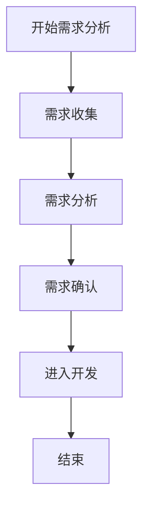

# 需求分析完整指南

## 📋 目录
1. [需求分析流程与图表](#需求分析流程与图表)
2. [需求分析工具与模板](#需求分析工具与模板)
3. [需求分析检查与改进](#需求分析检查与改进)

## 🎯 概述

本指南提供了需求分析的完整流程、工具、模板和最佳实践，帮助团队系统性地进行需求分析工作。

### 核心价值
- **标准化流程** - 建立统一的需求分析流程
- **实用工具** - 提供可操作的分析工具和模板
- **质量保证** - 建立检查清单和改进机制
- **可视化展示** - 使用Mermaid图表清晰展示流程

### 适用场景
- 新产品需求分析
- 功能迭代需求分析
- 技术债务评估
- 业务需求调研
- 用户需求收集

## 📊 需求分析总体流程

## 🔄 关键阶段

### 阶段1：需求收集与识别
- 用户反馈与投诉收集
- 业务部门需求调研
- 技术债务识别
- 竞品分析
- 市场趋势分析

### 阶段2：需求分析与验证
- 需求可行性分析
- 需求优先级排序
- 风险评估
- ROI分析

### 阶段3：需求规格定义
- 需求文档编写
- 需求评审与确认
- 验收标准定义

## 📈 成功指标

- **需求变更率** < 20%
- **需求理解偏差率** < 10%
- **需求完成率** > 90%
- **需求分析周期时间** 控制在合理范围
- **需求评审通过率** 达到预期目标

## 🚀 快速开始

1. **熟悉流程** - 阅读需求分析流程与图表
2. **使用模板** - 参考需求分析工具与模板
3. **执行检查** - 按照需求分析检查与改进执行
4. **持续改进** - 根据实际使用情况优化流程

---

## 📚 详细内容

请参考以下三个子文件获取详细信息：

### [需求分析流程与图表](./需求分析流程与图表.md)
包含完整的流程图、关键节点、质量检查流程等可视化内容。

### [需求分析工具与模板](./需求分析工具与模板.md)
包含实用的工具、方法、模板和最佳实践。

### [需求分析检查与改进](./需求分析检查与改进.md)
包含检查清单、常见问题、改进建议和成功指标。

---

*本指南持续更新，如有问题或建议，请及时反馈。*
