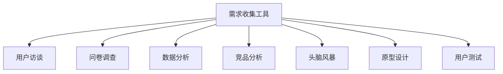
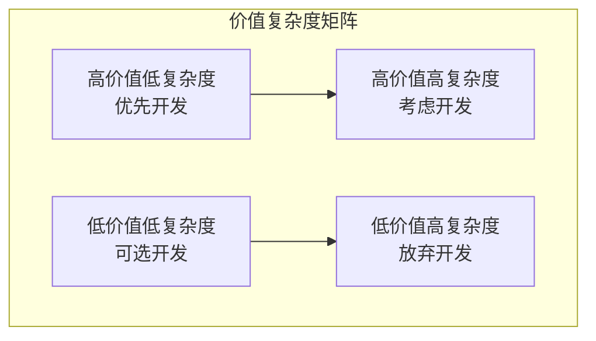

# 需求分析工具与模板

## 🛠️ 需求分析工具与方法

### 需求收集工具



#### 1. 用户访谈
- **适用场景**：深入了解用户需求和痛点
- **执行要点**：
  - 准备结构化问题清单
  - 选择代表性用户样本
  - 记录详细访谈内容
  - 分析用户反馈模式

#### 2. 问卷调查
- **适用场景**：大规模用户需求调研
- **执行要点**：
  - 设计简洁明了的问题
  - 使用多种题型（单选、多选、评分）
  - 确保样本数量充足
  - 分析数据趋势和模式

#### 3. 数据分析
- **适用场景**：基于现有数据的需求挖掘
- **执行要点**：
  - 分析用户行为数据
  - 识别使用模式异常
  - 挖掘潜在改进点
  - 量化需求优先级

### 需求分析工具

#### 1. 用户故事地图
- **用途**：可视化用户旅程和功能需求
- **制作方法**：
  - 横轴：用户活动时间线
  - 纵轴：功能优先级层次
  - 卡片：具体功能需求

#### 2. 功能分解图
- **用途**：将复杂需求分解为可管理的功能模块
- **制作方法**：
  - 顶层：主要功能模块
  - 中层：子功能模块
  - 底层：具体功能点

#### 3. 优先级矩阵
- **用途**：客观评估需求优先级
- **评估维度**：
  - 业务价值（高/中/低）
  - 技术复杂度（高/中/低）
  - 用户影响（高/中/低）

#### 4. 风险评估表
- **用途**：识别和评估需求实现风险
- **评估维度**：
  - 技术风险
  - 业务风险
  - 资源风险
  - 时间风险

### 需求验证工具

#### 1. 原型设计
- **用途**：验证需求理解和用户体验
- **工具推荐**：
  - Figma（在线协作）
  - Sketch（Mac专用）
  - Adobe XD（跨平台）

#### 2. 用户测试
- **用途**：验证需求满足用户期望
- **测试方法**：
  - A/B测试
  - 可用性测试
  - 用户访谈

#### 3. 专家评审
- **用途**：从专业角度评估需求质量
- **评审要点**：
  - 技术可行性
  - 业务合理性
  - 用户体验

## 📝 需求分析模板

### 需求描述模板

```
需求ID：[编号]
需求标题：[简洁描述]
需求类型：[功能/非功能/优化/修复]
优先级：[Must/Should/Could/Won't]
提出人：[姓名]
提出时间：[日期]

业务背景：
[描述业务背景和问题]

需求描述：
[详细描述需求内容]

用户故事：
作为[用户角色]
我希望[功能描述]
以便[价值/目标]

验收标准：
1. [具体可测试的标准]
2. [具体可测试的标准]
3. [具体可测试的标准]

技术考虑：
[技术实现相关考虑]

风险评估：
[潜在风险及应对措施]

依赖关系：
[与其他需求的依赖关系]

估算信息：
- 开发工作量：[人天]
- 测试工作量：[人天]
- 总工作量：[人天]
```

### 需求评审模板

#### 评审检查清单
- [ ] 需求描述是否清晰明确？
- [ ] 用户故事是否完整？
- [ ] 验收标准是否可测试？
- [ ] 技术方案是否可行？
- [ ] 风险评估是否充分？
- [ ] 资源估算是否合理？

#### 评审流程
1. **自评**：需求提出人自我检查
2. **同行评审**：同级别同事评审
3. **专家评审**：技术专家评审
4. **干系人确认**：业务方确认

### 需求变更控制模板

#### 变更申请表单
```
变更申请ID：[编号]
原需求ID：[编号]
变更类型：[新增/修改/删除]
变更原因：[详细说明变更原因]
变更内容：[具体变更内容]
影响评估：[对项目的影响]
风险评估：[变更带来的风险]
建议方案：[推荐的变更方案]
```

#### 变更审批流程
1. **提交变更申请**
2. **影响评估分析**
3. **技术可行性验证**
4. **成本效益分析**
5. **变更委员会审批**
6. **实施变更计划**

## 🔍 需求分析方法

### 5W1H分析法

#### What（什么）
- 这个需求是什么？
- 需要实现什么功能？
- 具体的业务场景是什么？

#### Why（为什么）
- 为什么需要这个需求？
- 解决什么业务问题？
- 带来什么价值？

#### Who（谁）
- 谁需要这个功能？
- 目标用户是谁？
- 涉及哪些干系人？

#### When（什么时候）
- 什么时候需要？
- 优先级如何？
- 时间计划如何？

#### Where（在哪里）
- 在哪里使用？
- 涉及哪些系统？
- 部署环境如何？

#### How（如何）
- 如何实现？
- 技术方案如何？
- 实施步骤如何？

### 价值分析框架

#### 业务价值分析
- **收入增长**：直接或间接带来的收入
- **成本降低**：减少的运营成本
- **效率提升**：提高的工作效率
- **风险控制**：降低的业务风险

#### 用户价值分析
- **功能价值**：满足的功能需求
- **体验价值**：改善的用户体验
- **情感价值**：提升的用户满意度
- **社会价值**：产生的社会效益

#### 技术价值分析
- **技术债务**：解决的技术问题
- **架构优化**：改善的系统架构
- **性能提升**：提高的系统性能
- **维护性**：改善的系统维护性

## 📊 需求优先级评估

### MoSCoW方法

#### Must have（必须有）
- 核心功能，没有就无法满足基本需求
- 影响项目成功的必要条件
- 通常占总需求的60%

#### Should have（应该有）
- 重要功能，对用户体验有显著影响
- 如果时间允许应该实现
- 通常占总需求的20%

#### Could have（可以有）
- 锦上添花的功能
- 对用户体验有改善但非必需
- 通常占总需求的15%

#### Won't have（不会有）
- 当前版本不实现的功能
- 可能在未来版本中考虑
- 通常占总需求的5%

### 价值-复杂度矩阵



#### 决策原则
- **优先开发**：高价值低复杂度的需求
- **考虑开发**：高价值高复杂度的需求
- **可选开发**：低价值低复杂度的需求
- **放弃开发**：低价值高复杂度的需求

## 🎯 最佳实践

### 需求收集最佳实践
1. **多渠道收集**：不要只依赖单一来源
2. **用户为中心**：始终从用户角度思考
3. **数据驱动**：基于数据分析做决策
4. **持续迭代**：需求收集是一个持续过程

### 需求分析最佳实践
1. **结构化分析**：使用系统化的分析方法
2. **多角度评估**：从技术、业务、用户多个角度评估
3. **量化指标**：尽可能使用量化指标
4. **风险识别**：提前识别和评估风险

### 需求验证最佳实践
1. **原型验证**：使用原型验证需求理解
2. **用户测试**：让真实用户参与验证
3. **专家评审**：邀请相关专家参与评审
4. **迭代优化**：根据反馈持续优化需求

---

*返回 [需求分析完整指南](./需求分析完整指南.md)*
