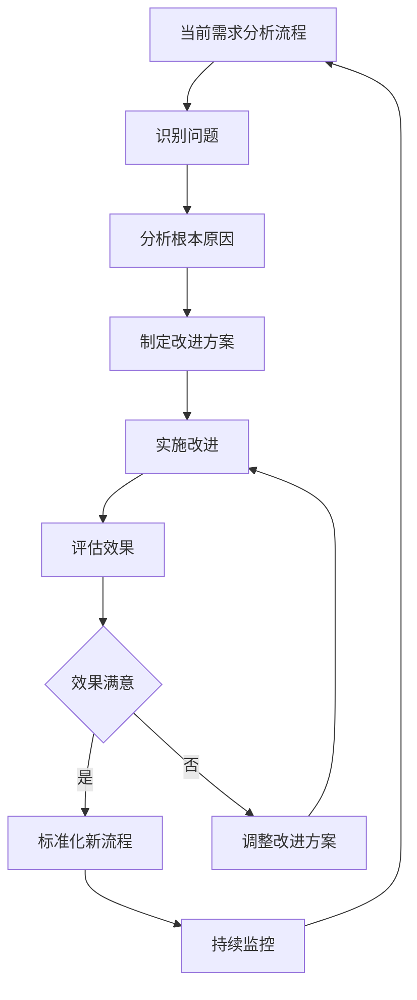

# 需求分析检查与改进

## 📋 需求分析检查清单

### 📋 需求收集阶段检查

#### 需求来源检查
- [ ] 用户反馈渠道是否建立？
- [ ] 业务部门需求是否收集？
- [ ] 技术债务是否识别？
- [ ] 竞品分析是否完成？
- [ ] 市场趋势是否了解？

#### 需求整理检查
- [ ] 重复需求是否合并？
- [ ] 需求分类是否完成？
- [ ] 需求描述是否清晰？
- [ ] 需求编号是否分配？

### 🔍 需求分析阶段检查

#### 需求理解检查
- [ ] 5W1H分析是否完成？
  - [ ] What：需求是什么？
  - [ ] Why：为什么需要？
  - [ ] Who：谁需要？
  - [ ] When：什么时候需要？
  - [ ] Where：在哪里使用？
  - [ ] How：如何实现？

#### 价值分析检查
- [ ] 业务价值是否明确？
- [ ] 用户价值是否明确？
- [ ] 技术价值是否评估？
- [ ] 替代方案是否考虑？

#### 可行性检查
- [ ] 技术可行性是否评估？
- [ ] 资源可行性是否评估？
- [ ] 业务可行性是否评估？
- [ ] 风险评估是否完成？

#### 优先级检查
- [ ] MoSCoW分类是否完成？
- [ ] 价值-复杂度矩阵是否建立？
- [ ] 优先级排序是否确定？
- [ ] 依赖关系是否识别？

### 📝 需求规格阶段检查

#### 需求文档检查
- [ ] 需求文档是否编写？
- [ ] 用户故事是否定义？
- [ ] 验收标准是否明确？
- [ ] 技术考虑是否记录？

#### 需求评审检查
- [ ] 自评是否完成？
- [ ] 同行评审是否通过？
- [ ] 专家评审是否通过？
- [ ] 干系人是否确认？

### ✅ 需求确认阶段检查

#### 最终确认检查
- [ ] 需求范围是否确认？
- [ ] 优先级是否确认？
- [ ] 时间计划是否确认？
- [ ] 资源分配是否确认？

#### 交付准备检查
- [ ] 需求文档是否交付？
- [ ] 原型设计是否完成？（如需要）
- [ ] 技术方案是否确认？
- [ ] 测试计划是否制定？

## 🎯 质量检查要点

### 需求完整性
- [ ] 需求描述是否完整？
- [ ] 验收标准是否明确？
- [ ] 依赖关系是否识别？
- [ ] 风险评估是否充分？

### 需求可行性
- [ ] 技术方案是否可行？
- [ ] 资源是否充足？
- [ ] 时间是否合理？
- [ ] 预算是否可控？

### 需求价值
- [ ] 业务价值是否明确？
- [ ] 用户价值是否明确？
- [ ] ROI是否合理？
- [ ] 是否符合产品战略？

### 需求可测试性
- [ ] 验收标准是否可测试？
- [ ] 测试用例是否可编写？
- [ ] 测试环境是否具备？
- [ ] 测试数据是否准备？

## ⚠️ 常见问题检查

### 需求描述问题
- [ ] 需求描述是否清晰？
- [ ] 是否有具体示例？
- [ ] 是否使用用户故事格式？
- [ ] 是否需要原型验证？

### 优先级问题
- [ ] 优先级标准是否量化？
- [ ] 是否建立优先级矩阵？
- [ ] 是否定期重评估？
- [ ] 是否考虑依赖关系？

### 变更控制问题
- [ ] 变更流程是否建立？
- [ ] 变更影响是否评估？
- [ ] 变更冻结期是否设置？
- [ ] 变更记录是否完整？

### 技术方案问题
- [ ] 技术专家是否参与？
- [ ] 可行性是否验证？
- [ ] 备选方案是否准备？
- [ ] 技术风险是否评估？

## 📊 成功指标检查

### 需求质量指标
- [ ] 需求变更率 < 20%？
- [ ] 需求理解偏差率 < 10%？
- [ ] 需求完成率 > 90%？

### 效率指标
- [ ] 需求分析周期时间是否合理？
- [ ] 需求评审通过率是否达标？
- [ ] 需求文档完整性是否满足？

### 价值指标
- [ ] 需求实现后用户满意度如何？
- [ ] 业务价值达成率如何？
- [ ] ROI实现情况如何？

## 🚀 行动建议

### 如果检查不通过
1. **需求描述不清晰** → 使用用户故事格式重写
2. **优先级不明确** → 建立量化评估标准
3. **技术方案不明确** → 技术专家参与评审
4. **资源不足** → 重新评估或调整范围

### 持续改进
1. **定期回顾** → 每月回顾需求分析质量
2. **收集反馈** → 从开发团队收集反馈
3. **优化流程** → 根据反馈优化分析流程
4. **培训提升** → 定期培训需求分析技能

## 🔧 常见问题与解决方案

### 问题1：需求范围蔓延
**问题描述**：需求在开发过程中不断变化和增加
**解决方案**：
- 建立需求变更流程
- 明确变更影响评估
- 设置需求冻结期
- 定期回顾需求范围

### 问题2：需求理解偏差
**问题描述**：开发团队对需求理解与业务方不一致
**解决方案**：
- 使用原型验证理解
- 定期需求评审会议
- 建立需求确认机制
- 使用用户故事格式

### 问题3：优先级混乱
**问题描述**：所有需求都被标记为高优先级
**解决方案**：
- 建立优先级评估标准
- 使用量化指标
- 定期优先级重评估
- 考虑依赖关系

### 问题4：技术方案不明确
**问题描述**：技术实现方案模糊不清
**解决方案**：
- 技术专家参与评审
- 进行技术可行性验证
- 制定备选方案
- 评估技术风险

## 📈 改进建议

### 流程优化
1. **标准化流程**：建立统一的需求分析流程
2. **模板化文档**：使用标准化的需求文档模板
3. **自动化工具**：引入需求管理工具
4. **定期回顾**：建立定期回顾和改进机制

### 团队能力提升
1. **技能培训**：定期进行需求分析技能培训
2. **经验分享**：建立经验分享和最佳实践库
3. **外部学习**：参加行业会议和培训
4. **认证考试**：鼓励团队获取相关认证

### 工具和方法改进
1. **工具升级**：使用更先进的需求管理工具
2. **方法创新**：尝试新的需求分析方法
3. **数据驱动**：基于数据分析做决策
4. **用户参与**：让用户更多参与需求分析过程

## 🔄 改进循环



## 📅 改进计划模板

### 月度改进计划
```
改进周期：[月份]
改进目标：[具体目标]
改进措施：[具体措施]
负责人：[负责人]
时间节点：[时间安排]
预期效果：[预期结果]
```

### 季度回顾报告
```
回顾周期：[季度]
主要成就：[重要成果]
存在问题：[需要改进的地方]
改进计划：[下季度计划]
资源需求：[需要的资源]
```

---

## 📚 相关资源

### 推荐阅读
- 《用户故事与敏捷方法》
- 《需求工程：软件工程实践》
- 《产品经理手册》

### 在线资源
- [需求分析最佳实践](https://example.com)
- [用户故事编写指南](https://example.com)
- [需求优先级评估方法](https://example.com)

### 工具推荐
- **需求管理**：Jira、Azure DevOps、PingCode
- **原型设计**：Figma、Sketch、Adobe XD
- **用户调研**：SurveyMonkey、问卷星、腾讯问卷

---

*返回 [需求分析完整指南](./需求分析完整指南.md)*
