# 需求分析流程与图表

## 📊 需求分析总体流程

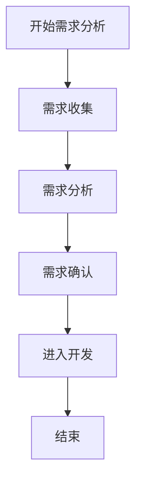

## 🔍 需求收集详细流程

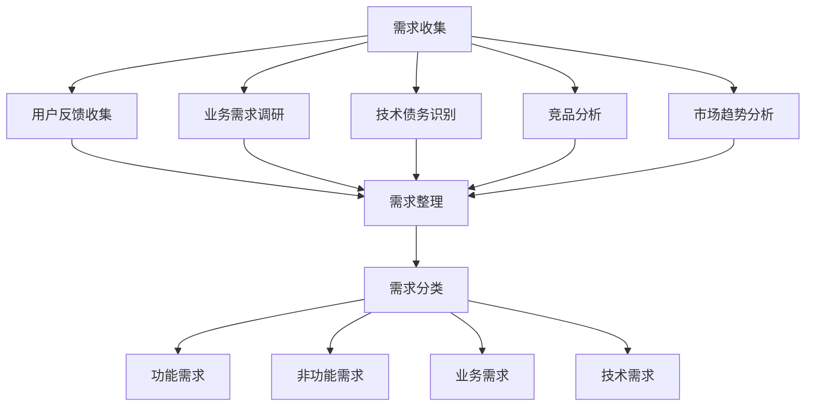

## 📈 需求分析详细流程

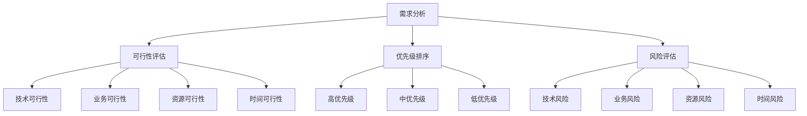

## ✅ 需求确认详细流程

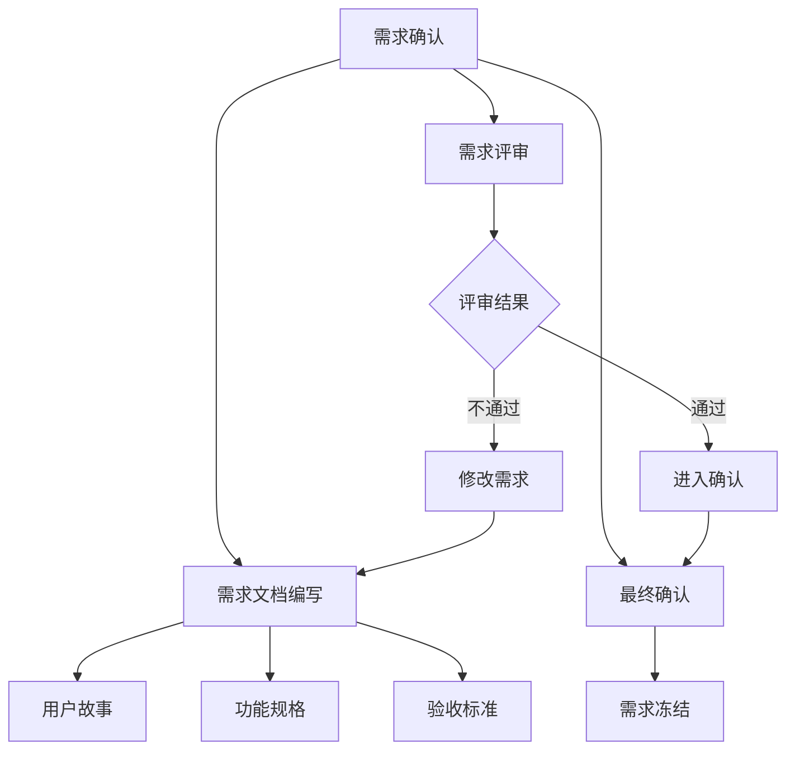

## 🔍 质量检查流程

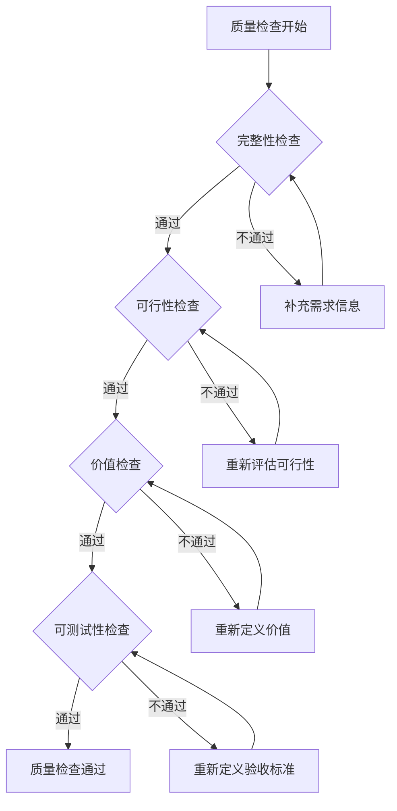

## 🎯 优先级评估矩阵

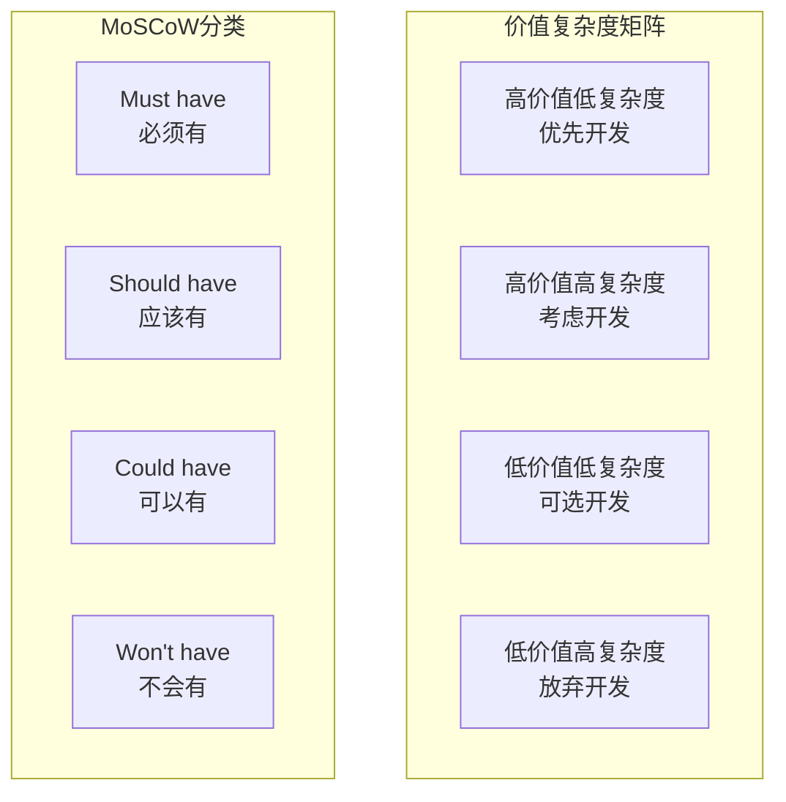

## 📅 时间规划甘特图

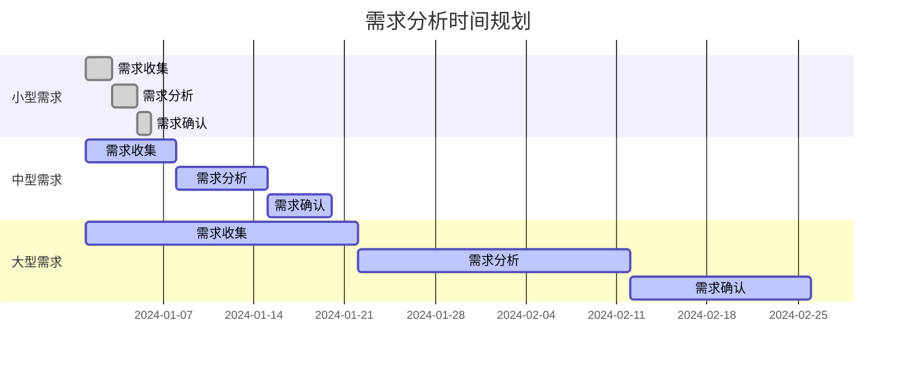

## 🔄 需求变更控制流程

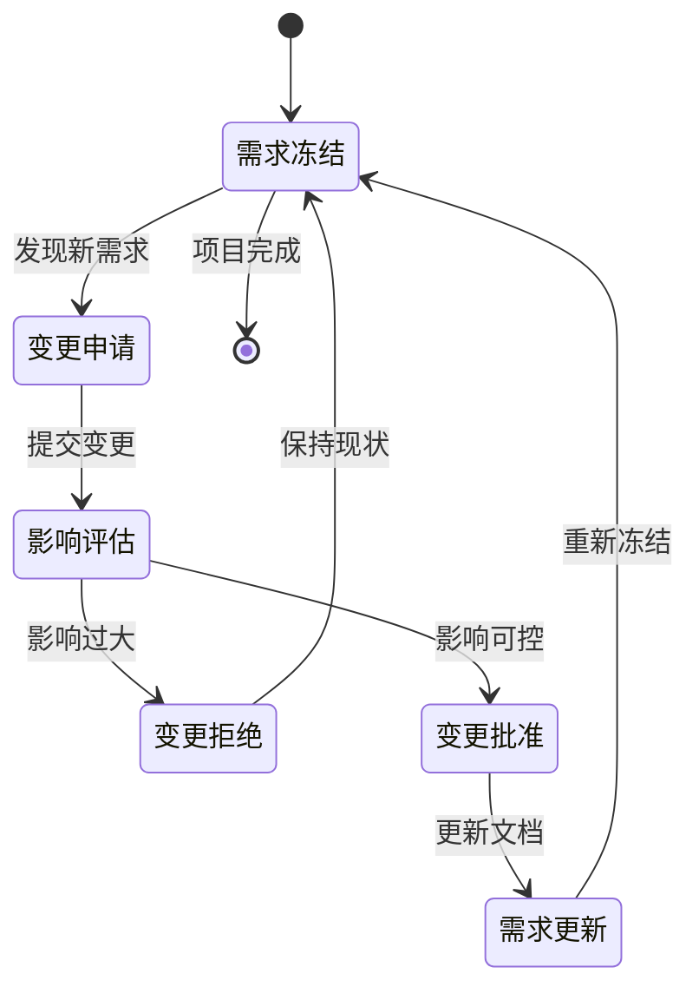

## 📊 成功指标监控

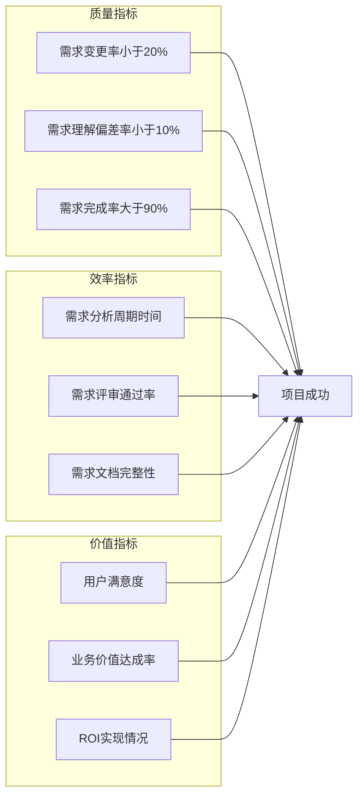

## 🔧 需求分析工具链

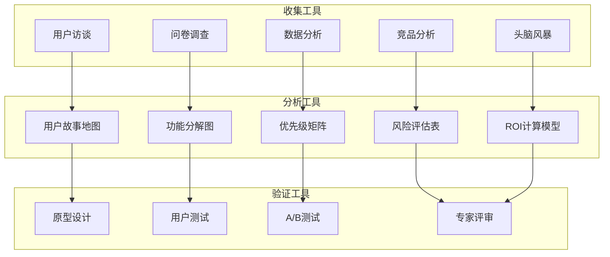

## 🚀 持续改进循环

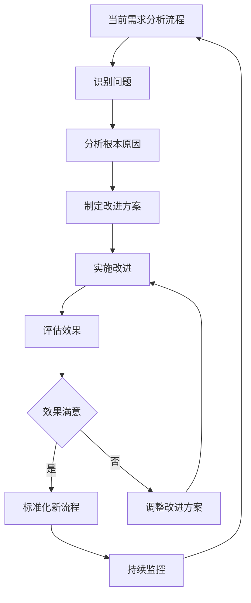

---

## 📋 关键节点检查清单

### 节点1：需求收集完成
- [ ] 所有需求来源已识别
- [ ] 需求已初步分类
- [ ] 需求描述清晰明确
- [ ] 相关干系人已确认

### 节点2：需求分析完成
- [ ] 需求可行性已评估
- [ ] 优先级已排序
- [ ] 依赖关系已识别
- [ ] 风险评估已完成

### 节点3：需求规格确认
- [ ] 需求文档已编写
- [ ] 验收标准已定义
- [ ] 跨部门评审已通过
- [ ] 最终确认已获得

---

*返回 [需求分析完整指南](./需求分析完整指南.md)*
