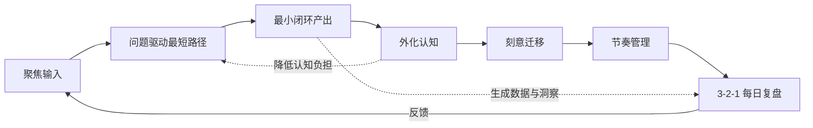
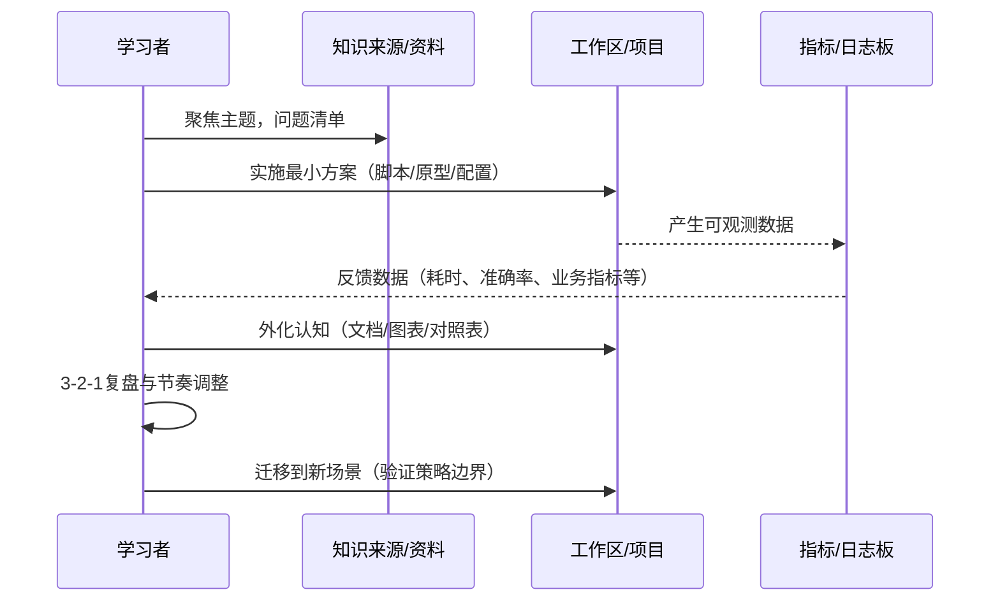

🎯 学习变“通透”的通用方法论（精简版）

### 一、核心方法论（6 条）
- 🔍 聚焦输入：一周只攻一个主题，其它一律入收件箱，不展开。
- ❓ 问题驱动：只学能解决当前问题的最短路径，不做面面俱到收集。
- 🔁 最小闭环：每学一块，立刻产出一个可运行/可上线的小成果（脚本、配置、监控面板、文档）。
- 🧠 外化认知：用流程图/时序图/对照表把易忘、易混信息写出脑外。
- 🔀 刻意迁移：每掌握一个概念，思考它在其它模块/技术下的迁移策略与边界。
- ⏱️ 节奏管理：25-5 番茄，4 个番茄做一次长复盘；设定清晰“完成定义”。

### 二、完成定义（DoD）
- 🗺️ 能画出流程/时序
- ▶️ 能跑通最小 Demo
- 🗣️ 能给同事讲清 5 分钟

### 三、每日微循环（10 分钟复盘）
- 3️⃣ 三个新点：今天吸收的 3 个关键概念
- 2️⃣ 两个落地：在项目里各对应一个具体应用场景
- 1️⃣ 一个疑问：最卡点，作为明天第一任务

### 四、最小闭环示例（通用）
- 主题：围绕当下最重要的问题（业务、技术、运营、数据分析等）
- 产出：
  - 🧰 小工具：用最少成本验证一个关键假设（脚本、原型、实验）
  - 📈 观测：为关键指标建立可视化或日志，形成可衡量反馈
  - 📝 文档：记录关键决策、配置要点与优化清单

### 五、外化清单（随手可查）
- 🧭 核心概念对照表（相近/易混概念一页清）
- 🧩 策略选择清单（适用场景、优劣、边界条件）
- 🗃️ 命名与缓存键设计（面向业务/场景的键、失效策略）

### 六、刻意迁移提问卡
- 若从当前场景迁移到 另一个模块/团队/技术栈：
  - 策略如何调整？
  - 数据/缓存/命名需要怎样重构？
  - 规模或复杂度提升时的瓶颈点是什么？

### 七、一周节奏建议（每天 30–60 分钟）
- Mon：选题与拆分、定义 DoD、搭建最小环境
- Tue：过核心概念 → 做第一个最小产出
- Wed：接入观测/日志 → 形成可衡量闭环
- Thu：做迁移练习（换模块/团队/技术设想）
- Fri：复盘 3-2-1，完善文档与对照表
- Weekend：轻量回顾与归档，列下周选题

### 八、步骤交互图（流程图）

### 九、学→用→反馈（时序图）

---

✅ 立即可用的行动指令
- 今天：挑一个主题，写下 DoD；用 2 个番茄做出第一个“可运行的小产出”。
- 明天：按 3-2-1 复盘，补齐流程图/对照表；做一次“刻意迁移”思考。